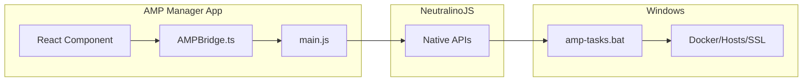
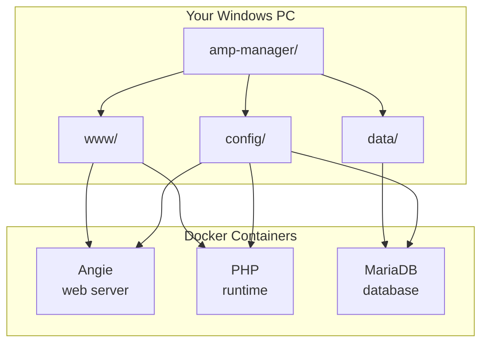

# Architecture Overview

Two things you need to understand:

1. **How the UI talks to your system** (commands)
2. **How Docker accesses your files** (data)


## 1. Command Flow (UI -> System)



**Simple explanation:**  

| Step | What Happens |
|------|-------------|
| 1. You click a button | React component calls `ampBridge.someAction()` |
| 2. AMPBridge sends it | Calls `window.AMP.someAction()` in main.js |
| 3. main.js validates | Checks if the task is in the whitelist |
| 4. Neutralino runs it | Executes `amp-tasks.bat some_action` |
| 5. Batch does the work | Modifies hosts, SSL, Docker, files |
| 6. Returns JSON | `{ "status": "ok", ... }` |


## 2. Data Flow (Docker -> Your Files)




**Bind mounts** connect containers to your folders:

| Folder | Container | What's Inside |
|--------|-----------|---------------|
| `config/` | Angie, PHP, MariaDB | angie.conf, php.ini, db-init scripts |
| `www/` | Angie, PHP | Your website code (editable in IDE) |
| `data/` | MariaDB | Database files (persists between runs) |


## Why This Matters

- **Your code is in `www/`** - edit in VS Code, changes appear in PHP container
- **Your configs are in `config/`** - modify angie.conf, Angie reloads
- **Your data is in `data/`** - database survives container restarts


## Quick Reference

```
amp-manager/
|-- amp-tasks.bat      # Handles UI commands
|-- docker-compose.yml # Defines containers
|-- config/            # Shared with containers
|   |-- angie-sites/   # Per-domain configs
|   |-- certs/         # SSL certificates
|   |-- mkcert.exe     # SSL generator
|-- www/               # Your websites (edit here!)
|   |-- example.local/
|-- data/              # Database files
```


## Related Docs

- [Amp-tasks Reference](./amp-tasks-reference) - All available commands
- [Workflows & Deployment](./workflows-deployment) - SSH, SFTP, deployment