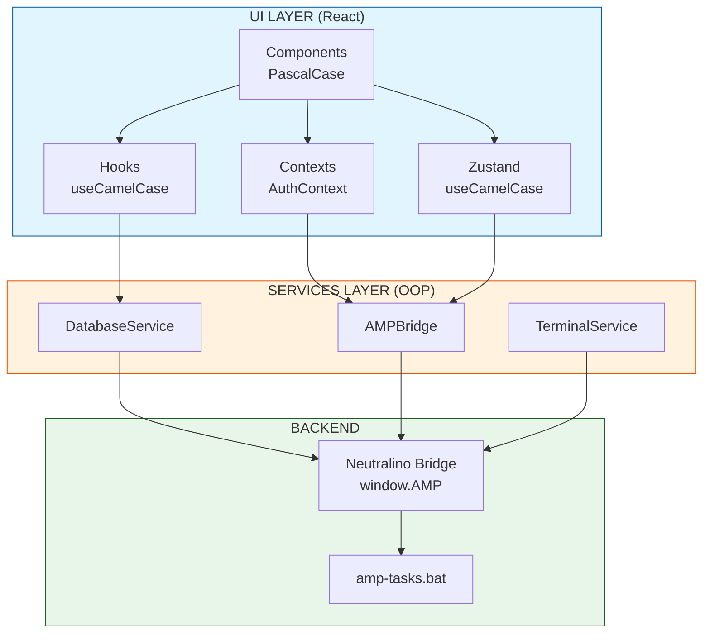
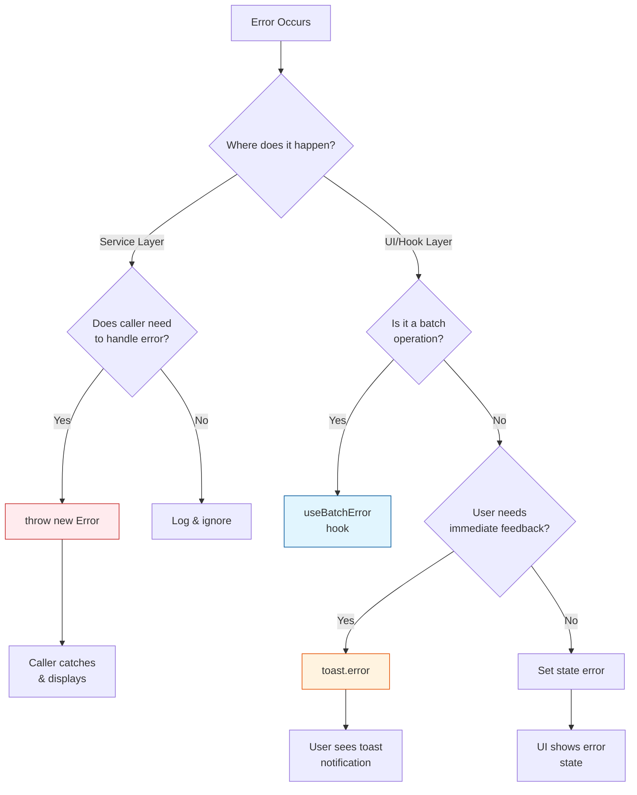

# Contributing to AMP Manager

Thank you for your interest in contributing!

## Development Workflow

### 1. Fork & Clone

```bash
git clone https://github.com/Amp-Manager/amp-manager.git
cd amp-manager
npm install
```

### 2. Create a Feature Branch

```bash
git checkout -b feature/your-feature-name
# or
git checkout -b fix/your-fix-description
```

### 3. Development

```bash
# Start development server (port 3000)
npm run dev

# Build for production
npm run build

# Run type checking
npm run lint
```

### 4. Commit & Push

```bash
git add .
git commit -m "feat: add new feature description"
git push origin feature/your-feature-name
```

### 5. Create Pull Request

- Open a PR on GitHub
- Fill out the PR template
- Link any related issues

---

## Code Architecture Patterns

AMP Manager uses a hybrid architecture that evolved from different developer backgrounds. This section documents the patterns so contributors can maintain consistency.

### Services Layer (OOP Pattern)

Services in `src/services/` use traditional OOP (likely from PHP/C backgrounds):

```typescript
// Singleton pattern with class
class DatabaseService {
  async listDatabases(): Promise<DatabaseInfo[]> { ... }
}

export const databaseService = new DatabaseService();
```

**Files using this pattern:**
- `DatabaseService.ts`
- `AMPBridge.ts`
- `TerminalService.ts`
- `ConfigGuardService.ts`
- `BackupService.ts`
- `AngieStatusService.ts`

### UI Layer (React Patterns)

React components and hooks use standard React patterns:
- Hooks: `useCamelCase` naming
- Contexts: `AuthContext`, `SyncContext`
- State: Zustand stores (`useDockerSettings`)

### Naming Conventions

| Layer | Pattern | Example |
|-------|---------|---------|
| Services | `camelCase` | `databaseService`, `ampBridge` |
| React Hooks | `useCamelCase` | `useProjectSync`, `useAuth` |
| Zustand stores | `useCamelCase` | `useDockerSettings` |
| Components | `PascalCase` | `DomainTableView`, `SettingsPanel` |

### Architecture Flow



### Error Handling Decision Tree



### Error Handling

Three patterns are used across the codebase:

| Pattern | Usage |
|---------|-------|
| `try/catch` + `throw Error` | Services that need caller to handle errors |
| `try/catch` + `toast` | UI-friendly errors with user feedback |
| `useBatchError` hook | Batch operations with error collection |

---

## Code Style

- **TypeScript** - All new code should be TypeScript
- **ESLint** - Runs via `npm run lint`
- **Formatting** - Prettier handles formatting automatically

### Commit Message Format

```
<type>: <description>

[optional body]
```

Types:
- `feat`: New feature
- `fix`: Bug fix
- `refactor`: Code refactoring
- `docs`: Documentation
- `chore`: Maintenance tasks

Examples:
```
feat: add new tunnel service integration
fix: resolve domain uppercase handling
docs: update troubleshooting guide
```

---

## Project Structure

```
amp-manager/
|-- src/
|   |-- components/     # React UI components
|   |-- pages/         # Route pages
|   |-- services/      # Business logic (AMPBridge)
|   |-- context/       # React contexts
|   |-- stores/        # Zustand state stores
|   |-- hooks/         # Custom React hooks
|   |-- lib/           # Utilities (db, crypto)
|   |-- types/         # TypeScript types
|   |-- public/js/     # Frontend bridge (main.js)
|   |-- docs/          # Documentation
|   |-- amp-tasks.bat   # Windows batch backend
+-- neutralino.config.json
```

---

## Building the Application

The application requires UAC (User Account Control) elevation to function. Follow these steps to build a production executable:

### Build Steps

1. **Build the UI**: `npm run build`
   - Compiles React frontend to `resources/` directory

2. **Build the NeutralinoJS app**
   - `npm run build:app` - builds Windows x64 desktop app

3. **Clean non-Windows files** (optional but recommended)
   - `npm run build:clean` - removes Linux, macOS, ARM, and bin/ folders

4. **Add UAC manifest** (required)
   - Run `post-build.bat` - this uses ResourceHacker to embed the admin manifest into the executable
   - Without this, the app cannot access hosts file, create SSL certificates, or control Docker

> **IMPORTANT**: Step 4 is required! Without running `post-build.bat`, the app runs without admin privileges.

### Why UAC is Required

AMP Manager needs administrator privileges to:
- Modify the Windows hosts file
- Create SSL certificates (mkcert requires admin)
- Control Docker containers
- Bind to ports below 1024

---

## Testing Your Changes

1. **In Browser**: `npm run dev`
2. **In Desktop App**: `npm run build`, then run `amp-manager.exe`

### Key Areas to Test

- Domain creation/removal
- Docker container control
- JSON file persistence
- Workflow execution

---

## Security Considerations

When adding new features:

1. **New Neutralino API?** -> Update `nativeAllowList` in `neutralino.config.json`
2. **New batch command?** -> Add to `AMP_TASKS` whitelist in `public/js/main.js`
3. **Sensitive data?** -> Use JSON storage with encryption (see `src/lib/db.ts`)

---

## Questions?

- Open an issue for bugs or feature requests
- Check [Home](./Home) for overview
- See [Troubleshooting](./troubleshooting) for common issues