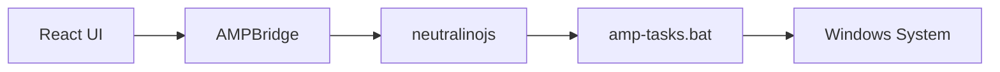
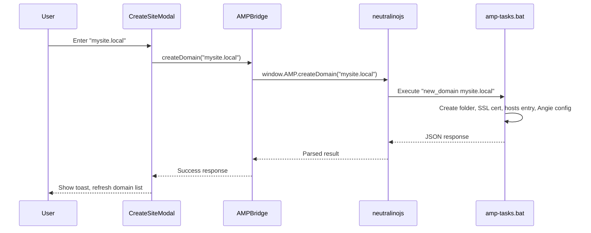

# Core Concepts

## How it works

## Docker integration

## Tunneling

## SSL certificates

# Architecture Overview

## High-Level Architecture

AMP Desktop uses a three-layer architecture:



| Layer | Role |
|-------|------|
| **React UI** | User interface built with React + TypeScript |
| **Neutralino Bridge** | JavaScript middleware exposing `window.AMP` API |
| **Batch Backend** | Windows batch file for system operations |

---

## Entry Point Flow

```
index.html
    +-- src/main.tsx (Neutralino detection + dev mode check)
        +-- src/App.tsx (Router + Providers)
            +-- Pages (Dashboard, Domains, Docker, etc.)
```

**Key**: `src/main.tsx` detects: 
- Neutralino desktop app (uses filesystem storage)
- Browser dev server at localhost (uses localStorage fallback)

---

## The Bridge Pattern

Communication flows through three coordinated files:

### 1. AMPBridge Service

Singleton service that all components use for backend calls.

**File**: `src/services/AMPBridge.ts`

```typescript
// Usage in any component
const ampBridge = AMPBridge.getInstance();
const result = await ampBridge.version();
// result = { status: "ok", version: "1.0.0", ... }
```

Key lines:
- `src/services/AMPBridge.ts:23-25` - Availability check
- `src/services/AMPBridge.ts:30-56` - Generic `call()` method

### 2. Neutralino Bridge

Exposes `window.AMP` API to the frontend.

**File**: neutralino `main.js`

Key lines:
- neutralino `main.js:47-88` - Generic `amp()` executor with JSON parsing
- neutralino `main.js:91-120` - `window.AMP` API exposure

### 3. Batch Backend

Windows batch file with labeled subroutines. Each task outputs JSON.

**File**: `amp-tasks.bat`

Key lines:
- `amp-tasks.bat:141-145` - Simple VERSION task example
- `amp-tasks.bat:30-86` - Task dispatcher (routes to labels)

---

## Adding a New Backend Task

To add a new task (e.g., `get_php_version`):

### Step 1: amp-tasks.bat

Add to dispatcher:

```batch
if /i "%~1"=="get_php_version" goto :GET_PHP_VERSION
```

Add subroutine:

```batch
:GET_PHP_VERSION
setlocal EnableDelayedExpansion
for /f "tokens=*" %%i in ('docker compose exec -T php php -v') do set "PHP_VERSION=%%i"
echo {"status":"ok","php_version":"!PHP_VERSION!"}
endlocal
exit /b 0
```

### Step 2: neutralino `main.js`

Add to AMP_TASKS whitelist (~line 6-44):

```javascript
get_php_version: true,
```

Add to window.AMP (~line 91+):

```javascript
getPhpVersion: () => amp("get_php_version"),
```

### Step 3: src/services/AMPBridge.ts

Add wrapper method:

```typescript
public getPhpVersion() { 
    return this.call<AmpResponse & { php_version: string }>('getPhpVersion'); 
}
```

### Step 4: src/types/amp.d.ts

Add type definition:

```typescript
getPhpVersion: () => Promise<AmpResponse & { php_version: string }>;
```

**Checklist**: whitelist -> expose -> bridge -> types

---

## Data Flow Example: Creating a Domain



Each step:
1. User enters domain name in modal
2. Component calls `ampBridge.createDomain(name)`
3. Bridge calls `window.AMP.createDomain(name)`
4. Neutralino executes batch task
5. Batch creates folder, SSL cert, adds hosts entry, generates Angie config
6. Returns JSON with success/failure for each step

---

## Key Directories

| Directory | Purpose |
|-----------|---------|
| `src/pages/` | Route pages (Dashboard, Domains, Docker, etc.) |
| `src/components/` | Reusable UI components |
| `src/services/` | Business logic (AMPBridge, BackupService) |
| `src/context/` | React contexts (Auth, Errors, Sync) |
| `src/stores/` | Zustand state stores |
| `src/lib/` | Utilities (db.ts, crypto.ts, slug.ts) |
| `www/` | Static sites for local domains |
| `resources/` | Production build output for Neutralino |

---

## Next Steps

- [State Management](./03-State-Management.md) - JSON file storage and Zustand patterns
