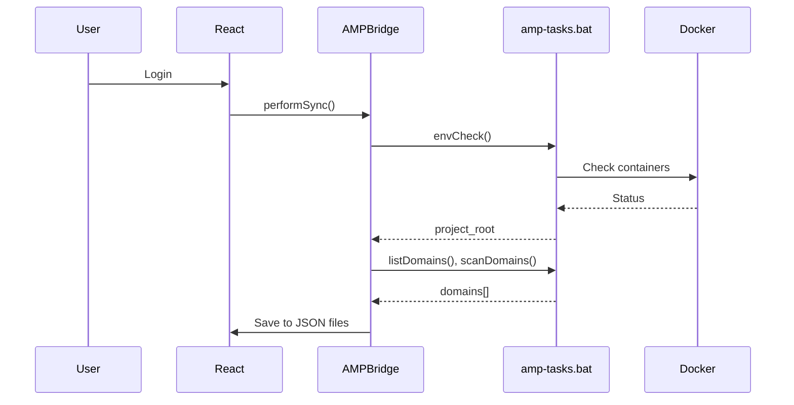

# AMP Manager for Developers

This guide is for developers who want to understand, extend, or contribute to AMP Manager.


## Quick Start


```bash
# Clone and setup
git clone https://github.com/Amp-Manager/amp-manager.git
cd amp-manager
npm install

# Development UI (Vite dev server on port 3000)
npm run dev

# Run full Neutralino desktop app
npm run dev:app

# Build React UI (vite build)
npm run build

# Build Windows executable
npm run build:app

# Clean non-Windows files + bin/
npm run build:clean

# Build app + clean 
npm run build:win
```

<Badge type="warning" text="POST-BUILD" />

> **IMPORTANT**: After build the executable, you **MUST** run `post-build.bat` to apply the UAC manifest. The app must run with admin privileges.


## TypeScript Types

AMP Manager uses `@neutralinojs/lib` npm package but also provides custom type definitions:

| File | Purpose |
|------|---------|
| `node_modules/@neutralinojs/lib/` | Used by `neu build` (no import needed) |
| `src/types/neutralino.d.ts` | Custom types for `window.Neutralino` |
| `src/types/amp.d.ts` | Custom types for `window.AMP` API |

**No need to import** `@neutralinojs/lib` in your code - it's automatically embedded by the CLI during `neu build`.

The custom types provide IDE autocomplete for:
- `window.AMP` (the backend bridge)
- `window.Neutralino` (Neutralino APIs)


## Stability Patterns

AMP Manager uses these patterns to prevent NeutralinoJS backend freeze:

| Pattern | Purpose | Usage |
|---------|---------|-------|
| `execWithTimeout()` | Wraps batch calls with 30s timeout | `execWithTimeout('amp-tasks.bat docker.up')` |
| `execWithRetry()` | Retry on transient IPC failures | `execWithRetry(() => ampBridge.status())` |
| `startKeepalive()` | Heartbeat (30s) to prevent Windows suspension | Auto-started in main.tsx |
| **Watchdog** | Zombie recovery - monitors PID/port, restarts app | Spawned by `ampBridge.spawnWatchdog()` on startup |

**Why these exist:**

- NeutralinoJS runs on a single-threaded event loop - a hanging `os.execCommand()` blocks everything
- Windows may suspend "inactive" desktop apps after ~2 minutes
- Batch commands (Docker, SSL, etc.) can hang indefinitely without timeout
- The Neutralino event loop can become unresponsive (zombie state) without external monitoring

## Watchdog Details

The watchdog runs as a detached background process:

| Step | Action |
|------|--------|
| 1 | App starts → saves PID, port, instanceId to `config.json` |
| 2 | `ampBridge.spawnWatchdog()` spawns `amp-tasks.bat watch` as background process |
| 3 | Every 20s, checks: Is stored PID still running? Is exitFlag set? |
| 4 | If 3 failures in a row → kill app, restart automatically |
| 5 | On clean exit: set exitFlag → delete lock → exit |

**Lock File Mechanism** (prevents duplicate watchdogs):

```bat
:: Check if lock file exists (another watchdog is running)
if exist "%temp%\amp_watchdog.lock" (
    exit /b 0
)

:: Acquire lock by creating empty file
type nul > "%temp%\amp_watchdog.lock"
```

**ExitFlag Pattern** (clean user exit vs crash detection):

```bat
:: Check exitFlag FIRST - if user clicked X, this is true
findstr /i "\"exitFlag\":true" "%config.json%"
if not errorlevel 1 goto :CLEANUP

:: Otherwise check if app is still running...
tasklist /fi "PID eq %APP_PID%"
```

**Clean Close Flow:**
1. `handleClose()` sets `exitFlag=true` in config.json
2. Deletes `%temp%\amp_watchdog.lock`
3. Exits app → watchdog sees exitFlag, cleans up lock, exits

See:
- `src/services/AMPBridge.ts:342-353` - `spawnWatchdog()` implementation
- `src/services/AMPBridge.ts:359-389` - `killStaleWatchdogs()` (cleanup on startup)
- `src/components/layout/Layout.tsx:245-277` - `handleClose()` 3-step flow
- `amp-tasks.bat:1512-1585` - Full watchdog implementation


## Architecture Overview

```bash
AMP MANAGER STACK
================

  React          NeutralinoJS        Windows
  Frontend  -->  Native Bridge  -->  Batch
  (Vite)        (window.AMP)        (amp-tasks)

  JSON Files         (OS APIs)        (Hosts, SSL)
  (data/)
```

### Key Files

| File | Purpose |
|------|---------|
| `src/services/AMPBridge.ts` | Central hub for all backend calls |
| `src/lib/db.ts` | JSON storage functions |
| `resources/js/main.js` | Frontend bridge, validates tasks |
| `src/types/neutralino.d.ts` | TypeScript types for Neutralino API |
| `src/types/amp.d.ts` | TypeScript types for AMP API |
| `amp-tasks.bat` | Windows batch backend commands |
| `neutralino.config.json` | Neutralino settings + API allowlist |


## Key Concepts

### 1. Sync Flow (Every Login)

AMP runs a sync on every login to ensure consistency:





**Why sync runs every login:** See [Security](./security)

### 2. JSON Storage + Encryption

All user data is stored in JSON files in `users/user_{username}/` with selective encryption:

```typescript
// Sensitive files (encrypted with user's AES key)
- notes (users/user_{username}/notes.json)
- credentials (users/user_{username}/credentials.json) 
- settings (users/user_{username}/settings.json)
- workflows (users/user_{username}/workflows.json)
- site_configs (users/user_{username}/site_configs.json)

// Plain files (no encryption)
- sites (users/user_{username}/sites.json)
- tags (users/user_{username}/tags.json)
- tunnels (users/user_{username}/tunnels.json)
- activity_logs (users/user_{username}/activity_logs.json)
- domain_status (users/user_{username}/domain_status.json)
- databases (users/user_{username}/databases.json)
- databases_cache (users/user_{username}/databases_cache.json)
- user (users/user_{username}/user.json) - salt + validation token only
```

**Encryption flow:**

```
Password -> PBKDF2 -> AES Key -> Encrypt -> JSON Files
```

### 3. App Initialization & User State

On app startup, AMP Manager restores user state to enable JSON operations:

**Flow:**
1. `main.tsx` loads `config.json` → gets `lastUser`
2. Calls `setCurrentUser(lastUser)` to set global `_currentUser`
3. Global `_currentUser` enables `ensureUser()` in `db.ts`

**Why this matters:**
- Users don't need to re-login after app restart
- JSON storage functions work immediately without auth errors
- Dashboard loads correct user data on startup

**Key code:**
- `src/lib/db.ts:12-14` - `setCurrentUser()` function
- `src/lib/db.ts:28-31` - `ensureUser()` throws if not set
- `src/main.tsx:16-18` - Restores user on startup

### 4. User Parameter Pattern for JSON Functions

When saving data, use the explicit `user` parameter for reliability:

```typescript
// Encrypted files - user at args[0], data at args[1], key at args[2]
await saveNotesJSON(user, allNotes, formData.is_encrypted ? encryptionKey : undefined);
await saveCredentialsJSON(user, creds, encryptionKey);
await saveSettingsJSON(user, settings, encryptionKey);

// Plain files - data at args[0] (user comes from global _currentUser)
await saveSitesJSON(allSites);
await saveDomainStatusJSON(statuses);

// BUT: Pass user explicitly in sync to ensure correct folder
await saveSitesJSON(user, filteredSites);
await saveDomainStatusJSON(user, allStatuses);
```

**Key rule:** In async operations (like sync), always pass user explicitly to ensure data saves to the correct user's folder.

### 3. Service Layer Pattern

AMP uses a hybrid architecture:

| Layer | Pattern | Example |
|-------|---------|---------|
| Services | OOP (class + singleton) | `DatabaseService` |
| Hooks | React hooks | `useProjectSync` |
| State | Zustand | `useDockerSettings` |

See [Contributing](./contributing) for full patterns.


## Common Development Tasks

### Adding a New Backend Command

**1. Add to amp-tasks.bat:**
```batch
:myCommand
echo %~1
exit /b 0
```

**2. Whitelist in public/js/main.js:**
```javascript
const AMP_TASKS = {
  // ...
  'myCommand': true,
};
```

**3. Add to AMPBridge.ts:**
```typescript
public myCommand(param: string) {
  return this.call<AmpResponse>('myCommand', param);
}
```

**4. Add to nativeAllowList (if needed):**
In `neutralino.config.json`, add required APIs.

### Adding a New Page

**1. Create the component:**  

```typescript
// src/pages/MyNewPage.tsx
export function MyNewPage() {
  return <div>My New Page</div>;
}
```

**2. Add the route:**  

```typescript
// src/App.tsx
import { MyNewPage } from './pages/MyNewPage';

<Route path="/my-new-page" element={<MyNewPage />} />
```

### Using Services in Components

```typescript
import { ampBridge } from '@/services/AMPBridge';
import { databaseService } from '@/services/DatabaseService';

function MyComponent() {
  const handleClick = async () => {
    const result = await ampBridge.listDomains();
    // or
    const databases = await databaseService.listDatabases();
  };
}
```


## Debugging Tips

### Browser Console

- Open DevTools (F12)
- Check Console for errors
- Filter by "AMP" or your feature


### Backend Logs

```bash
# Check amp-tasks output
# In App Terminal, run commands directly
```

### Docker Logs

```bash
# View container logs
docker logs angie_amp
docker logs db_amp
```


## Testing Checklist

Before submitting a PR:

```text
[ ] `npm run lint` passes  
[ ] `npm run build` succeeds  
[ ] New feature works in browser (`npm run dev`)  
[ ] New feature works in desktop app  
[ ] Error states handled gracefully  
[ ] No console.log statements  
```


## File Organization

```text
src/
|-- components/      # Reusable UI components
|   |-- layout/      # Layout (Sidebar, Layout)
|   |-- domains/     # Domain-related components
|   |-- databases/   # Database components
|   |-- settings/    # Settings panels
|   |-- workflow/    # Workflow editor
|   |-- notes/       # Notes components
|-- pages/           # Route pages
|-- services/        # Business logic (AMPBridge, DatabaseService)
|-- context/         # React contexts (Auth, Sync)
|-- hooks/           # Custom hooks (useProjectSync)
|-- stores/          # Zustand stores
|-- lib/             # Utilities (db, crypto)
|-- types/           # TypeScript definitions
```


## JSON Storage 

### Function Signatures <Badge type="warning" text="IMPORTANT" />

Understanding the argument patterns is critical to avoid bugs.   
There are **three distinct patterns**:

---

### Pattern 1: Encrypted Files <Badge type="info" text="user" /> <Badge type="tip" text="data" /> <Badge type="danger" text="key" />

Used for files that store sensitive data. Key is at `args[2]`, data at `args[1]`:

```typescript
// Functions using this pattern:
saveNotesJSON(user, data, key?)
saveCredentialsJSON(user, data, key?)
saveSettingsJSON(user, data, key?)
saveWorkflowsJSON(user, data, key?)
saveSiteConfigsJSON(user, data, key?)

// Example:
await saveNotesJSON(user, notes, encryptionKey);
await saveSettingsJSON(user, settings, encryptionKey);  // key is optional
```

**In db.ts:**
```typescript
export async function saveNotesJSON(..._args: any[]): Promise<void> { 
  const data = _args[1] || [];  // data at index 1
  const key = _args[2] instanceof CryptoKey ? _args[2] : null;  // key at index 2
  await dataStorage.saveUser(ensureUser(), 'notes.json', data, key ? { encrypt: true, key } : undefined); 
}
```

---

### Pattern 2: Plain User Files <Badge type="tip" text="data" />

Used for non-sensitive data. Data at `args[0]`:

```typescript
// Functions using this pattern:
saveTagsJSON(data)
saveTunnelsJSON(data)
saveActivityLogsJSON(data)
saveDatabasesJSON(data)
saveDatabasesCacheJSON(data)

// Example:
await saveTagsJSON(tags);
await saveTunnelsJSON(tunnels);
```

**In db.ts:**
```typescript
export async function saveTagsJSON(..._args: any[]): Promise<void> { 
  const data = _args[0] || [];  // data at index 0
  await dataStorage.saveUser(ensureUser(), 'tags.json', data); 
}
```
   

---

### Pattern 3: Plain Files WITH <Badge type="info" text="user" /> <Badge type="tip" text="data" />

Used for files that need explicit user (for sync reliability). User at `args[0]`, data at `args[1]`:

```typescript
// Functions using this pattern:
saveSitesJSON(user, data)
saveDomainStatusJSON(user, data)

// Example:
await saveSitesJSON(user, filteredSites);
await saveDomainStatusJSON(user, allStatuses);
```

**In db.ts:**
```typescript
export async function saveSitesJSON(..._args: any[]): Promise<void> { 
  const data = _args[1] || [];  // data at index 1 (NOT index 0!)
  await dataStorage.saveUser(ensureUser(), 'sites.json', data); 
}
```

---
   
      

### Common Bug

Using Wrong Index    


<Badge type="danger" text="WRONG" /> **DON'T do this:**
```typescript
// WRONG - saves "nuno" (username) instead of data!
await saveSitesJSON(user, filteredSites);  // if function expects data at args[0]
```

<Badge type="info" text="CORRECT" /> **DO this:**
```typescript
// CORRECT - know which pattern your function uses
await saveSitesJSON(user, filteredSites);   // Pattern 3: user at args[0], data at args[1]
await saveTagsJSON(tags);                   // Pattern 2: data at args[0]
await saveNotesJSON(user, notes, key);      // Pattern 1: user at args[0], data at args[1], key at args[2]
```

### The `is_encrypted` Toggle Pattern

For notes, the UI toggle determines whether to encrypt:

```typescript
// In useNotes.ts handleSaveNote:
await saveNotesJSON(user, allNotes, formData.is_encrypted ? encryptionKey : undefined);
//                   ^user    ^data         ^key only when toggle is ON
```

This ensures normal notes are saved as plain text (when toggle is OFF), while encrypted notes use the encryption key.

### Sync Process Flow  <Badge type="warning" text="IMPORTANT" />

The sync in `useProjectSync.ts` follows this flow:

```typescript
// 1. Load existing data
const existingSitesArray = Array.isArray(existingSites) ? existingSites : [];
const existingStatusesArray = Array.isArray(existingStatuses) ? existingStatuses : [];

// 2. Scan for new domains from backend
const domainStatuses = ampDomains.map(d => ({ ... }));
const newDomains = new Set(domainStatuses.map(s => s.domain));

// 3. Build combined statuses (remove old for scanned domains, add fresh data)
// IMPORTANT: Filter OUT domains that will be re-scanned (!newDomains.has)
const existingToKeep = existingStatusesArray.filter(s => !newDomains.has(s.domain));
const allStatuses = [...existingToKeep, ...domainStatuses];
await saveDomainStatusJSON(user, allStatuses);

// 4. Build combined sites (update existing or add new)
// Uses findIndex to update if exists, push if new
const allSites = [...existingSitesArray];
for (const status of domainStatuses) {
  const siteIndex = allSites.findIndex(s => s.id === status.domain);
  if (siteIndex >= 0) {
    allSites[siteIndex] = site;  // Update existing
  } else {
    allSites.push(site);  // Add new
  }
}
await saveSitesJSON(user, allSites);

// 5. Save timestamp
await saveSettingsJSON(user, settings);
```

**Key points:**
- Step 3 uses `!newDomains.has()` to REMOVE old entries before adding fresh scan data - prevents duplication
- Step 4 uses `findIndex` to update in-place rather than filter + concatenate (which would cause duplication)
- This ensures exactly 1 entry per domain in both domain_status.json and sites.json


## Config.json Merge Pattern <Badge type="warning" text="IMPORTANT" />

When updating `config.json`, you must merge with existing data to preserve watchdog instance info:

### The Problem

The `config.json` file stores both:
- **User data:** `lastUser`
- **Instance data:** `instanceId`, `pid`, `port`, `launchedAt`, `processName`

If you overwrite with only `{ lastUser }`, you lose instance info and the watchdog stops working.


<Badge type="info" text="CORRECT" /> **Use this pattern:**

```typescript
// CORRECT - always merge
const existing = await dataStorage.load('config.json') || {};
await dataStorage.save('config.json', { ...existing, lastUser: username });
```

<Badge type="danger" text="WRONG" /> **DON'T do this:**

```typescript
// WRONG - overwrites instance info
await dataStorage.save('config.json', { lastUser: username });
```

### Where This Applies

| Location | Context | Status |
|----------|---------|--------|
| `AuthContext.tsx` | Login/Register/Logout | ✅ Fixed |
| `db.ts` | deleteUserData() | ✅ Fixed |
| `main.tsx` | updateInstanceInfo() | ✅ Already correct |

### Why It Matters

- Watchdog reads PID/port from config.json to monitor app health
- If overwritten, watchdog can't detect app failure
- Auto-recovery fails, users see frozen app

### Instance Info Fields

| Field | Source | Purpose |
|-------|--------|---------|
| `instanceId` | Generated at startup | Unique identifier |
| `processName` | Hardcoded | Process name for taskkill |
| `pid` | `window.NL_PID` | Process ID to monitor |
| `port` | `window.NL_PORT` | Port to check responsiveness |
| `launchedAt` | `Date.now()` | Timestamp for debugging | |


## What's Next?

| Goal | Link |
|------|------|
| Full architecture | [Architecture Overview](./architecture) |
| State management | [State Management](./state-management) |
| Troubleshooting | [Troubleshooting](./troubleshooting) |
| Workflows | [Workflows](./workflows-deployment) |
| API Reference | [API Reference](./api-reference) |
