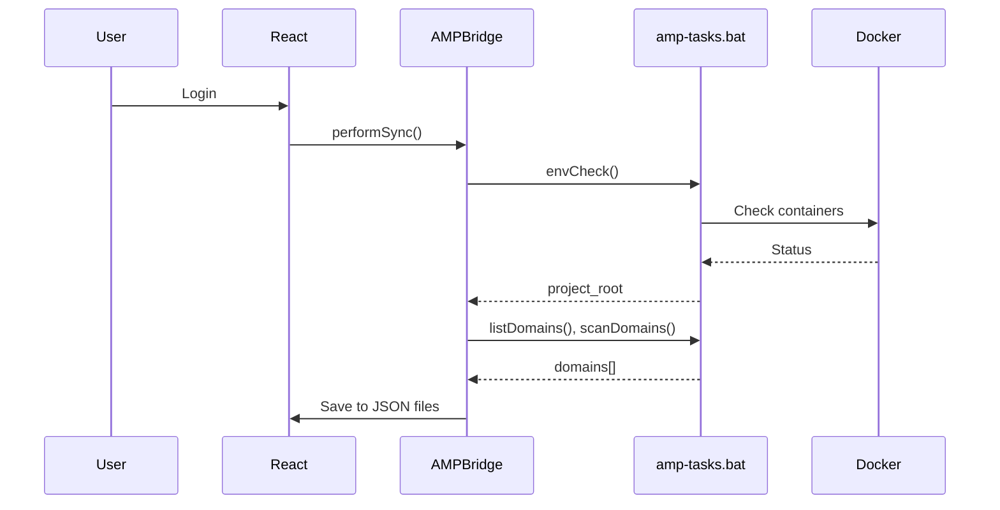

# AMP Manager for Developers

This guide is for developers who want to understand, extend, or contribute to AMP Manager.


## Quick Start


```bash
# Clone and setup
git clone https://github.com/Amp-Manager/amp-manager.git
cd amp-manager
npm install

# Development (Vite dev server on port 3000)
npm run dev

# Run full Neutralino desktop app
npm run dev:app

# Build React UI
npm run build

# Build Windows executable
npm run build:app
```

> **IMPORTANT**: After `npm run build:app`, you **MUST** run `post-build.bat` to apply the UAC manifest. Without this, the app runs without admin privileges.


### TypeScript Types

AMP Manager uses `@neutralinojs/lib` npm package but also provides custom type definitions:

| File | Purpose |
|------|---------|
| `node_modules/@neutralinojs/lib/` | Used by `neu build` (no import needed) |
| `src/types/neutralino.d.ts` | Custom types for `window.Neutralino` |
| `src/types/amp.d.ts` | Custom types for `window.AMP` API |

**No need to import** `@neutralinojs/lib` in your code - it's automatically embedded by the CLI during `neu build`.

The custom types provide IDE autocomplete for:
- `window.AMP` (your backend bridge)
- `window.Neutralino` (Neutralino APIs)


## Stability Patterns

AMP Manager uses these patterns to prevent NeutralinoJS backend freeze:

| Pattern | Purpose | Usage |
|---------|---------|-------|
| `execWithTimeout()` | Wraps batch calls with 30s timeout | `execWithTimeout('amp-tasks.bat docker.up')` |
| `execWithRetry()` | Retry on transient IPC failures | `execWithRetry(() => ampBridge.status())` |
| `startKeepalive()` | Heartbeat (60s) to prevent Windows suspension | Auto-started in main.tsx |

**Why these exist:**

- NeutralinoJS runs on a single-threaded event loop - a hanging `os.execCommand()` blocks everything
- Windows may suspend "inactive" desktop apps after ~2 minutes
- Batch commands (Docker, SSL, etc.) can hang indefinitely without timeout

See `src/services/AMPBridge.ts` for implementation.


## Architecture Overview

```bash
AMP MANAGER STACK
================

  React          NeutralinoJS        Windows
  Frontend  -->  Native Bridge  -->  Batch
  (Vite)        (window.AMP)        (amp-tasks)

  JSON Files         (OS APIs)        (Hosts, SSL)
  (data/)
```

### Key Files

| File | Purpose |
|------|---------|
| `src/services/AMPBridge.ts` | Central hub for all backend calls |
| `src/lib/db.ts` | JSON storage functions |
| `resources/js/main.js` | Frontend bridge, validates tasks |
| `src/types/neutralino.d.ts` | TypeScript types for Neutralino API |
| `src/types/amp.d.ts` | TypeScript types for AMP API |
| `amp-tasks.bat` | Windows batch backend commands |
| `neutralino.config.json` | Neutralino settings + API allowlist |


## Key Concepts

### 1. Sync Flow (Every Login)

AMP runs a sync on every login to ensure consistency:





**Why sync runs every login:** See [Security](./security)

### 2. JSON Storage + Encryption

All user data is stored in JSON files in `users/user_{username}/` with selective encryption:

```typescript
// Sensitive files (encrypted with user's AES key)
- notes (users/user_{username}/notes.json)
- credentials (users/user_{username}/credentials.json) 
- settings (users/user_{username}/settings.json)
- workflows (users/user_{username}/workflows.json)
- site_configs (users/user_{username}/site_configs.json)

// Plain files (no encryption)
- sites (users/user_{username}/sites.json)
- tags (users/user_{username}/tags.json)
- tunnels (users/user_{username}/tunnels.json)
- activity_logs (users/user_{username}/activity_logs.json)
- domain_status (users/user_{username}/domain_status.json)
- databases (users/user_{username}/databases.json)
- databases_cache (users/user_{username}/databases_cache.json)
- user (users/user_{username}/user.json) - salt + validation token only
```

**Encryption flow:**

```
Password -> PBKDF2 -> AES Key -> Encrypt -> JSON Files
```

### 3. Service Layer Pattern

AMP uses a hybrid architecture:

| Layer | Pattern | Example |
|-------|---------|---------|
| Services | OOP (class + singleton) | `DatabaseService` |
| Hooks | React hooks | `useProjectSync` |
| State | Zustand | `useDockerSettings` |

See [CONTRIBUTING.md](./CONTRIBUTING) for full patterns.

---

## Common Development Tasks

### Adding a New Backend Command

**1. Add to amp-tasks.bat:**
```batch
:myCommand
echo %~1
exit /b 0
```

**2. Whitelist in public/js/main.js:**
```javascript
const AMP_TASKS = {
  // ...
  'myCommand': true,
};
```

**3. Add to AMPBridge.ts:**
```typescript
public myCommand(param: string) {
  return this.call<AmpResponse>('myCommand', param);
}
```

**4. Add to nativeAllowList (if needed):**
In `neutralino.config.json`, add required APIs.

### Adding a New Page

**1. Create the component:**
```typescript
// src/pages/MyNewPage.tsx
export function MyNewPage() {
  return <div>My New Page</div>;
}
```

**2. Add the route:**
```typescript
// src/App.tsx
import { MyNewPage } from './pages/MyNewPage';

<Route path="/my-new-page" element={<MyNewPage />} />
```

### Using Services in Components

```typescript
import { ampBridge } from '@/services/AMPBridge';
import { databaseService } from '@/services/DatabaseService';

function MyComponent() {
  const handleClick = async () => {
    const result = await ampBridge.listDomains();
    // or
    const databases = await databaseService.listDatabases();
  };
}
```

---

## Debugging Tips

### Browser Console

- Open DevTools (F12)
- Check Console for errors
- Filter by "AMP" or your feature

### Backend Logs

```bash
# Check amp-tasks output
# In App Terminal, run commands directly
```

### Docker Logs

```bash
# View container logs
docker logs angie_amp
docker logs db_amp
```

---

## Testing Checklist

Before submitting a PR:

- [ ] `npm run lint` passes
- [ ] `npm run build` succeeds
- [ ] New feature works in browser (`npm run dev`)
- [ ] New feature works in desktop app
- [ ] Error states handled gracefully
- [ ] No console.log statements

---

## File Organization

```
src/
|-- components/       # Reusable UI components
|   |-- layout/       # Layout (Sidebar, Layout)
|   |-- domains/      # Domain-related components
|   |-- databases/    # Database components
|   |-- settings/     # Settings panels
|   |-- workflow/     # Workflow editor
|   |-- notes/       # Notes components
|-- pages/            # Route pages
|-- services/        # Business logic (AMPBridge, DatabaseService)
|-- context/         # React contexts (Auth, Sync)
|-- hooks/           # Custom hooks (useProjectSync)
|-- stores/          # Zustand stores
|-- lib/             # Utilities (db, crypto)
|-- types/           # TypeScript definitions
```

---

## What's Next?

| Goal | Link |
|------|------|
| Full architecture | [Architecture Overview](./architecture) |
| State management | [State Management](./state-management) |
| Troubleshooting | [Troubleshooting](./troubleshooting) |
| Workflows | [Workflows](./workflows-deployment) |
| API Reference | [API Reference](./api-reference) |
