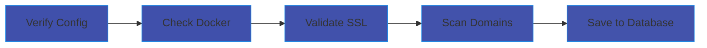
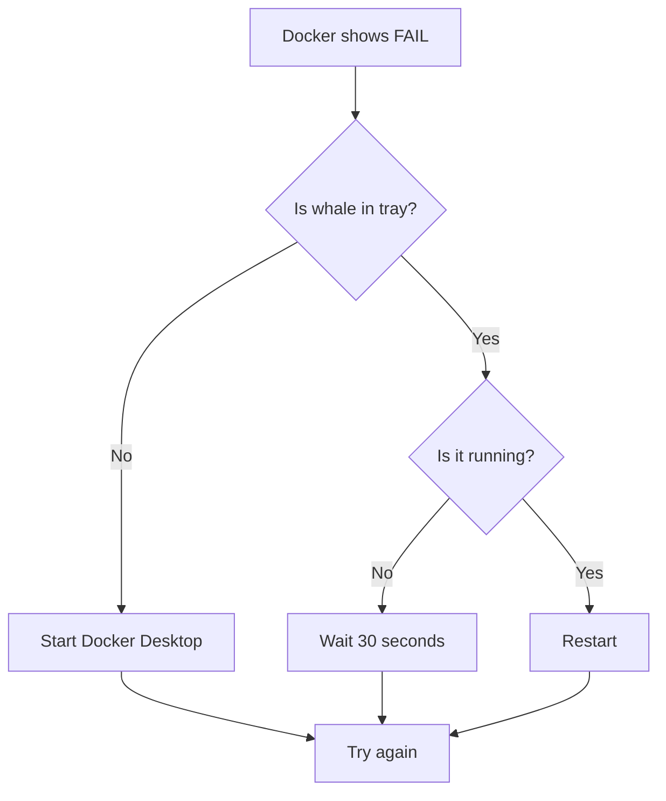

# AMP Manager For Users

Welcome! This guide walks you through AMP Manager from scratch. No prior experience with Docker or local servers needed.


## What You'll Set Up

By the end of this guide, you'll have:

- A local development environment for building websites
- Automatic HTTPS/SSL for your sites
- A dashboard to manage multiple projects
- Encrypted storage for your credentials


## Prerequisites

Before installing AMP Manager, ensure you have the following:


### 1. Docker Desktop   

Docker Desktop runs the web servers required for your local development sites.

Installation Steps:  

<Badge type="info" text="Download" />  

1. Visit the official [Docker Desktop for Windows](https://www.docker.com/products/docker-desktop/)
2. Click "Download for Windows"
3. Run the installer and follow the on-screen prompts.

**First Launch:**
- Docker will request administrator permissions (this is normal).
- Wait for the Docker whale icon in your system tray to display Running.
- Initial startup may take 2–4 minutes.

<Badge type="warning" text="WSL2" />

> If you receive a WSL2-related error, download and install the latest [WSL2 update package](https://aka.ms/wsl2kernel) from Microsoft, then restart Docker Desktop.


### 2. AMP Manager   

Installation Steps:   

<Badge type="info" text="Download" />

1. Download the latest [release of AMP Manager](https://github.com/Amp-Manager/amp-manager/releases)
2. Extract the contents to a dedicated folder e.g. `D:\amp-manager`
3. Open a terminal in that directory and initialize the required containers:   
   ```bash 
   docker compose up -d
   ```
4. Launch the application by running `amp-manager-win_x64.exe`
5. Windows dialog ask for administrator permission — click Yes to continue.


<Badge type="warning" text="Login" />

> Warning: There is no "Forgot Password". Your data is encrypted, if you lose it, your data is gone forever.


## Understanding the Dashboard

<p align="center">
  
</p>


| Top Section | What It Means |
|-------------|---------------|
| Docker Indicator | Green [Running] = containers active, Orange [Stopped] = containers stopped, Red [Off] = Docker service not running |
| New Domain | Opens a dialog to create a new domain |
| Search | Opens a search palette to filter projects by tags |
| Domains | Lists all local sites and projects managed by AMP Manager |
| Workflows | Shows the number of saved remote tasks |
| Certificates | SSL certificates issued by your Certificate Authority |
| Databases | Available MySQL/MariaDB databases for your projects |
| Notes | Stores plain-text and encrypted notes for your domains |
| Credentials | Encrypted login details for remote servers |
| Clear Cache & Logs | Removes cache and log files generated by the Angie web server |


## Your First Sync

When you first log in, AMP runs a "sync" to set up your environment.

**What happens during sync:**



**Don't worry if it takes a few seconds** - it's checking everything is working correctly.


## Install Your Root CA

To enable HTTPS on your local projects without browser warnings, AMP Manager creates a local Certificate Authority (CA). You need to trust this CA once on your computer.

<p align="center">
  
</p>


1. Go to the Certificates Page
Click Certificates in the sidebar.
2. Generate the Root CA   
AMP Manager automatically creates the required files:
- A private key (rootCA-key.pem)
- A root certificate (rootCA.pem)
3. Trust the Certificate (Important)   
You must add `rootCA.pem` to your system's trust store.   
  - **Windows**:   
  A dialog will appear. Click Install Certificate.   
  It's automatically installed in Trusted Root Certification Authorities.    
  - **Linux/macOS**:   
  Follow the on-screen prompts to add the certificate to your keychain.
4. Start Using HTTPS   
Once trusted, AMP Manager uses this CA to sign certificates for your local sites automatically.


## Creating Your First Site

Let's create a local site called `myproject.local`.

<p align="center">
  
</p>


### Step 1: Go to Domains

Click **Domains** in the sidebar.

### Step 2: Create New Domain

1. Click the button "Add Domain"
2. Enter: `myproject`
3. Click **Create**

### Step 3: What AMP Manager Does

Behind the scenes, AMP Manager:

1. Creates folder: `D:\amp-manager\www\myproject`
2. Adds entry to Windows hosts file
3. Creates SSL certificate (HTTPS support)
4. Configures web server (Angie/nginx)

Example files for `myproject.local` : 

Certificate: `D:\amp-manager\config\certs`  
Configuration: `D:\amp-manager\config\angie-sites`

### Step 4: Test It

1. Open your browser
2. Go to: `https://myproject.local`
3. You should see a welcome page (or blank if empty)

> **Note:** The "s" in https is important! SSL is automatic.


## Common Issues

## System Checks

<p align="center">
  
</p>


### Docker Running: FAIL




**Quick Fix:** Right-click Docker -> Restart -> Wait 30s -> Refresh AMP Manager


### "SSL: FAIL"

1. Go to **Certificates**
2. Verify Root CA is **installed** and SSL is **valid**
3. Restart Angie web server
4. Wait 10 seconds


### Site Not Loading

1. Check the URL has `https://` (not `http://`)
2. Try clicking **Sync** in the top bar
3. Check Docker is running (green on dashboard)
4. Restart Docker containers


## Glossary (For Now)

| Term | Simple Meaning |
|------|----------------|
| **Domain** | Your website's address (like `myportfolio.local`) |
| **SSL/HTTPS** | Secure connection (the lock icon) |
| **Docker** | Software that runs web servers in the background |
| **Sync** | AMP checking that everything is working |
| **Container** | A running web server (Angie, PHP, MariaDB) |


## What's Next?

Now that you have a site running:

| Goal | Do This |
|------|---------|
| Build a website | Add files to `D:\amp-manager\www\myproject` |
| Use a database | Go to **Databases** -> Add Database |
| Add notes | Go to **Notes** -> Add a note |
| Learn more | See [for-developers.md](./for-developers) |


## Need Help?

1. Visit [How To](./how-to)
1. Check [Troubleshooting](./troubleshooting)
2. Look at [Workflows](./workflows-deployment) for deployment guides
