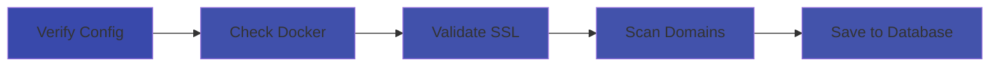
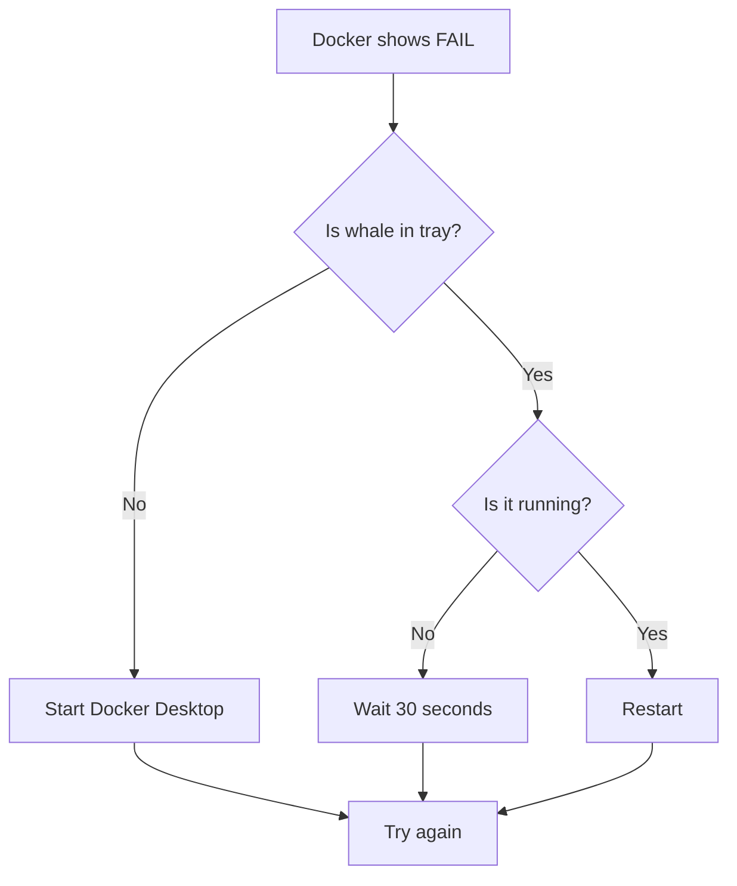

# AMP Manager For Users

Welcome! This guide walks you through AMP Manager from scratch. No prior experience with Docker or local servers needed.

## What You'll Build

By the end of this guide, you'll have:

- A local development environment for building websites
- Automatic HTTPS/SSL for your sites
- A dashboard to manage multiple projects
- Encrypted storage for your credentials

## Prerequisites

Before installing AMP Manager, you need:

### 1. Docker Desktop

Docker runs the web servers for your local sites.

**Download:**
1. Go to [Docker Desktop for Windows](https://www.docker.com/products/docker-desktop/)
2. Click "Download for Windows"
3. Run the installer

**First Launch:**
- Docker will ask for admin permission (this is normal)
- Wait for the whale icon in your system tray to show "Running"
- This may take 2-5 minutes on first install

<Badge type="info" text="WSL2" />

> If you see an error about WSL2, download the [WSL2 update package](https://aka.ms/wsl2kernel) from Microsoft and install it, then restart Docker.

## Understanding the Dashboard

  

| Top Section | What It Means |
|------|-------------|
| Titlebar Docker | [Running] Green = containers running, [Stopped] orange = containers stopped, [Off] Red = Docker not running |
| Titlebar New Domain | Opens a modal to create a new domain |
| Titlebar Search | Opens a palette to search and filter projects tags |
| Domains | Local sites you've created, all projects found in AMP Manager |
| Workflows | Number of remote saved tasks |
| Certificates | SSL certificates signed by your Certificate Authority |
| Databases | MySQL/MariaDB databases you can use |
| Notes | Notes created for domains, and encrypted notes |
| Credentials | Encrypted authentication of remote servers |
| Clear Cache & Logs | Delete files genrated by Angie web server |

## Your First Sync

When you first log in, AMP runs a "sync" to set up your environment.

**What happens during sync:**

**Don't worry if it takes 30-60 seconds** - it's checking everything is working correctly.

## Creating Your First Site

Let's create a local site called `myportfolio.local`.

### Step 1: Go to Domains

Click **Domains** in the sidebar.

### Step 2: Create New Domain

1. Click the **+** button or "Add Domain"
2. Enter: `myportfolio`
3. Click **Create**

### Step 3: What AMP Does

Behind the scenes, AMP:

1. Creates folder: `D:\amp-manager\www\myportfolio`
2. Adds entry to Windows hosts file
3. Creates SSL certificate (HTTPS support)
4. Configures web server (Angie/nginx)

### Step 4: Test It

1. Open your browser
2. Go to: `https://myportfolio.local`
3. You should see a welcome page (or blank if empty)

> **Note:** The "s" in https is important! SSL is automatic.

## Common Issues

## Activity Timeline & System Checks

  

### Docker Running: FAIL

**Quick Fix:** Right-click Docker -> Restart -> Wait 30s -> Refresh AMP

### "SSL: FAIL"

1. Go to **Settings** -> **Certificates**
2. Click **Regenerate SSL**
3. Wait 10 seconds
4. Restart Angie web server

### Site Not Loading

1. Check the URL has `https://` (not `http://`)
2. Try clicking **Sync** in the top bar
3. Check Docker is running (green on dashboard)
4. Restart Docker containers

## What's Next?

Now that you have a site running:

| Goal | Do This |
|------|---------|
| Build a website | Add files to `D:\amp-manager\www\myportfolio` |
| Use a database | Go to **Databases** -> Create one |
| Add notes | Go to **Notes** -> Add a note |
| Learn more | See [for-developers.md](./for-developers) |

## Glossary (For Now)

| Term | Simple Meaning |
|------|----------------|
| **Domain** | Your website's address (like `myportfolio.local`) |
| **SSL/HTTPS** | Secure connection (the lock icon) |
| **Docker** | Software that runs web servers in the background |
| **Sync** | AMP checking that everything is working |
| **Container** | A running web server (Angie, PHP, MariaDB) |

## Need Help?

1. Check [troubleshooting.md](./troubleshooting)
2. Look at [workflows.md](./workflows-deployment) for deployment guides
3. Ask in the community forum