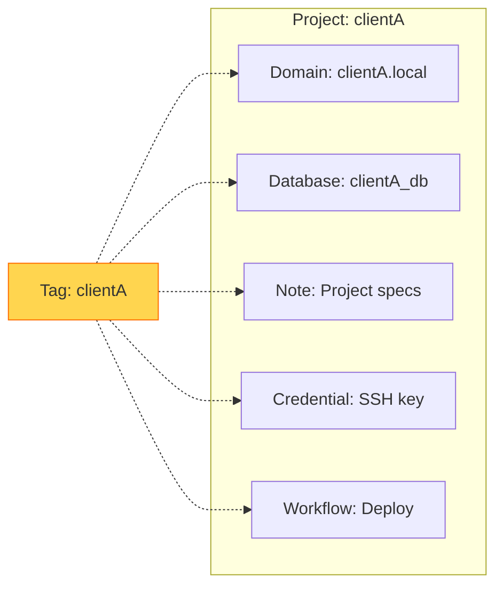
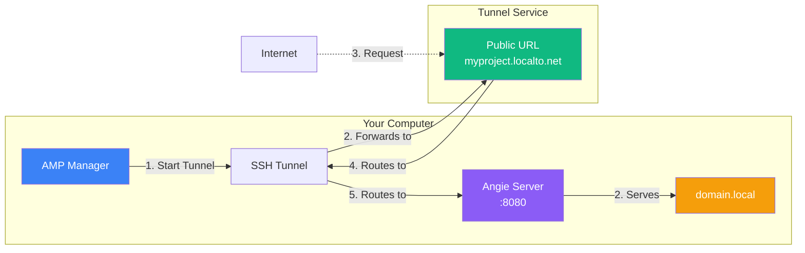

# How To

Common workflows and feature guides for AMP Manager.


## Project Organization with Tags

Use tags to group related items across AMP. Tag your domain, database, notes, credentials, and workflows with the same label for easy filtering.

### Example: "clientA" Project



### How to Use Tags

1. **Create a domain** -> Add tag "clientA"
2. **Create a database** -> Add tag "clientA"  
3. **Add notes** -> Add tag "clientA"
4. **Save credentials** -> Add tag "clientA"
5. **Build workflows** -> Add tag "clientA"

Now when you search in the **Command Palette** (Ctrl+K), type "clientA" to see all items related to that project!


## Set Up SSL for the First Time

### Step 1: Create Root CA

1. Go to **Settings** -> **Certificates**
2. Click **Create Root CA** (if not exists)
3. Accept the Windows security prompt


### Step 2: Create Your First Domain

1. Go to **Domains**
2. Click **+ Add Domain**
3. Enter: `myproject`
4. Click **Create**

AMP automatically:
- Creates folder at `C:\amp\www\myproject`
- Adds to Windows hosts file
- Generates SSL certificate

### Step 3: Verify SSL Works

1. Open browser
2. Go to `https://myproject.local`
3. You should see a welcome page (or blank if empty)

**Note:** Accept the security warning on first visit - this is because it's a local CA


## Connect to a Database

### Step 1: Create Database

1. Go to **Databases**
2. Click **+ Add Database**
3. Enter:
   - **Name**: `myapp`
   - **Username**: `admin`
   - **Password**: `secretpassword`
4. Click **Create**


### Step 2: Connect from Application

Your application connects using:

| Setting | Value |
|---------|-------|
| Host | `localhost` |
| Port | `3306` |
| Database | `myapp` |
| Username | `admin` |
| Password | `secretpassword` |


### Step 3: Connect with External Tool

1. Go to **Settings** -> **Database Tool**
2. Configure your tool path (e.g., phpMyAdmin, DBeaver)
3. Or use the built-in connection string


## Use Workflows for Deployment

### Simple Deploy Workflow

1. Go to **Workflows**
2. Click **+ New Workflow**
3. Add a **Source Node** (your local domain)
4. Add an **Action Node**:
   - Type: `shell`
   - Command: `git pull origin main`
5. Add a **Target Node**:
   - Type: `local`
   - Domain: (select your domain)
6. Click **Save** -> **Run**


### SFTP Deploy Workflow

1. Add **Source Node** (local domain)
2. Add **Action Node**:
   - Type: `sftp_sync`
   - Host: `your-server.com`
   - Username: `root`
   - Credential: (select your SSH key)
   - Remote Path: `/var/www/html`
3. Click **Save** -> **Run**


## Secure Notes with Encryption

### Step 1: Create an Encrypted Note

1. Go to **Notes**
2. Click **+ New Note**
3. Toggle **Encrypt** to ON
4. Enter your note content
5. Click **Save**

### Step 2: Access Encrypted Notes

- Encrypted notes require your password to be entered at login
- Once unlocked, they're readable like normal notes
- Close the app or logout to lock them again


## Use Command Palette

The Command Palette (Ctrl+K) lets you quickly search and navigate.


### Search by Tag

1. Press **Ctrl+K**
2. Type a tag name (e.g., "clientA")
3. See all items with that tag


### Quick Actions

| Shortcut | Action |
|----------|--------|
| `Ctrl+K` | Open Command Palette |
| `Ctrl+S` | Save (in forms) |
| `Ctrl+Shift+P` | Run workflow |


### Search Examples

```
# Find all items
clientA

# Find domains only
domain:clientA

# Find notes only  
note:meeting

# Find credentials
cred:production
```


## Set Up Tunnel Services

Tunnel services expose your local development sites to the internet via SSH, allowing you to share work with clients, test webhooks, or test on mobile devices. AMP Manager uses simple SSH-based tunnel services that don't require downloading extra software or complex authentication.


### How It Works

AMP Manager integrates with SSH-based tunnel services. Your local sites run on Angie server (port 8080) with virtual host configuration. The tunnel service forwards requests from a public URL to your local server.



**Quick Summary:**  

1. Click **Start Tunnel** in AMP Manager
2. Tunnel service creates a public URL (e.g., `myproject.localto.net`)
3. Anyone on the internet can visit that URL
4. Requests route back through SSH tunnel to Angie
5. Angie serves the correct domain based on the Host header

This lets you share your local development with students, mentors, or colleagues instantly - no deployment needed.


### Supported Services

| Service | Subdomain Format | Auth | Setup Required |
|---------|------------------|------|----------------|
| localhost.run | `{random}.localhost.run` | None | None |
| Serveo | `{name}.serveousercontent.com` | None | None |
| Localtonet | `{name}.localto.net` | Token | Free account |


### Placeholders

When configuring tunnel commands, use these placeholders:

| Placeholder | Description | Example |
|-------------|-------------|---------|
| `{domain}` | Full local domain | `myproject.local` |
| `{port}` | Local server port | `8080` |


### localhost.run

The simplest option - no setup required. The service assigns a random subdomain automatically.

```bash
ssh -R 80:{domain}:8080 nokey@localhost.run
# Example: ssh -R 80:myproject.local:8080 nokey@localhost.run
# -> https://{random}.localhost.run
```

- **Setup**: None - works out of the box
- **Pros**: Zero configuration, automatic HTTPS, completely free
- **Cons**: Random subdomain (changes each session), no custom names
- **Best for**: Quick testing, sharing with clients temporarily


#### WordPress

WordPress stores absolute URLs in the database. When using a tunnel, the public URL differs from your local `*.local` domain.

**Required Configuration:**
 
Add to your `wp-config.php`:

```php
// Use the tunnel URL dynamically
$scheme = isset($_SERVER['HTTPS']) && $_SERVER['HTTPS'] === 'on' ? 'https' : 'http';
define('WP_HOME', $scheme . '://' . $_SERVER['HTTP_HOST']);
define('WP_SITEURL', $scheme . '://' . $_SERVER['HTTP_HOST']);
```

**Alternative (plugin):**
- Install [Relative URL](https://wordpress.org/plugins/relative-url/) plugin
- Sets all URLs to relative paths

**Important:** Free subdomains change on reconnect. For persistent WordPress development, consider:
1. Custom Domain plan from localhost.run
2. Use Localtonet for stable URLs (free account, custom subdomain)


#### Laravel

Laravel generally works well with tunnels out of the box. One consideration:

**APP_URL Configuration:**
 
For proper URL generation in emails, notifications, and asset URLs:

```bash
# In your .env file - tunnel will override this
APP_URL=https://your-tunnel-url.localhost.run
```

For dynamic detection:

```php
// In config/app.php
'url' => env('APP_URL', 'http://localhost'),
```

Most Laravel apps work seamlessly - the tunnel handles the routing correctly.


### Serveo

Similar to localhost.run but allows custom subdomain names.

```bash
ssh -R {name}:80:{domain}:8080 serveo.net
# Example: ssh -R myproject:80:myproject.local:8080 serveo.net
# -> https://myproject.serveousercontent.com
```

- **Setup**: None - works out of the box
- **Pros**: Custom subdomain possible, no setup required, free
- **Cons**: Subdomain may be taken if you want a popular name
- **Best for**: Named tunnels without any account


### Localtonet

Requires a free account and token from localtonet.com. The service provides a user-friendly dashboard and supports persistent URLs.

```bash
ssh -p 223 -R {name}:80:{domain}:8080 YOUR_TOKEN@localto.net
# Example: ssh -p 223 -R myproject:80:myproject.local:8080 mytoken@localto.net
# -> https://myproject.localto.net
```

- **Setup**: Create free account at localtonet.com, generate token in dashboard
- **Pros**: Custom subdomain, persistent URLs, free dashboard to manage tunnels
- **Cons**: Requires token, different SSH port (223)
- **Best for**: Persistent tunnels with your own subdomain

**Getting your token:**
1. Visit [localtonet.com/register](https://localtonet.com/register) to create an account
2. Log in to the [Dashboard](https://localtonet.com/dashboard)
3. Go to **Tunnels -> New Tunnel** -> Select *HTTP*
4. Click **Settings** -> **SSH Command** to get your one-liner
5. Copy the token portion (before `@`) and add to Credentials in AMP Manager

**Reference:** See [Localtonet Zero-Install SSH Docs](https://localtonet.com/documents/zero-install-ssh) for more details.


#### Tunneling WordPress

Same configuration as localhost.run - add to `wp-config.php`:

```php
$scheme = isset($_SERVER['HTTPS']) && $_SERVER['HTTPS'] === 'on' ? 'https' : 'http';
define('WP_HOME', $scheme . '://' . $_SERVER['HTTP_HOST']);
define('WP_SITEURL', $scheme . '://' . $_SERVER['HTTP_HOST']);
```

**Advantage over localhost.run:** Localtonet persistent URLs don't change, so WordPress URL updates are one-time only.


#### Tunneling Laravel

Works out of the box. Set your `.env`:

```bash
APP_URL=https://myproject.localto.net
```


### Setup Steps

1. Go to **Settings** -> **Tunnel Services**
2. Enable your preferred tunnel provider
3. For Localtonet: Add your token to Credentials
4. Open domain details and click **Start Tunnel**
5. Copy the public URL to share

### Use Cases

- Share local site with client
- Test webhooks from external services (Stripe, GitHub, etc.)
- Mobile testing on real URL
- Demo prototypes without deployment

### Other Tunnel Services

AMP Manager includes the most popular SSH-based tunnel services. If you need to use other services like Cloudflare Tunnel, ngrok, or localtunnel, you can still connect them to your local development environment.

**Key Information:**  

- Angie server listens on port **8080**
- Use `{domain}:8080` as your local target (e.g., `myproject.local:8080`)
- This tells the tunnel service which virtual host to serve

**Example:**  
 
```bash
# Cloudflare Tunnel
cloudflare tunnel --url localhost:8080
# Or with specific domain:
cloudflare tunnel --url myproject.local:8080

# ngrok
ngrok http myproject.local:8080
```

**Requirements for other services:**
- Download their CLI binary (place in PATH or `/bin`)
- Configure API authentication (token, account)
- Different setup than SSH-based services


## How To: Backup and Restore

### Export Data

1. Go to **Settings** -> **Backup & Restore**
2. Click **Export Data**
3. Choose what to include:
   - Sites, notes, credentials, workflows, tags
   - Include sensitive data (encrypted)
4. Save the backup file


### Import Data

1. Click **Import Data**
2. Select backup file
3. Choose overwrite or merge
4. Import completes

**Tip:** Export regularly, especially before major changes


## How To: Run as Admin (First Time)

### Why Admin is Needed

AMP modifies system files:
- Windows hosts file
- SSL certificates
- Docker control

### First Time Setup

1. Right-click `amp-manager.exe`
2. Select **Run as administrator**
3. Accept UAC prompt
4. Continue normally

### After First Run

- Normal running is usually fine
- Re-run as admin if you see permission errors


## Quick Reference

| Goal | Where | Steps |
|------|-------|-------|
| Create site | Domains | + Add Domain |
| Create database | Databases | + Add Database |
| Add note | Notes | + New Note |
| Save credential | Credentials | + Add Credential |
| Deploy code | Workflows | New -> Run |
| SSL issue | Settings -> Certificates | Regenerate |
| Docker issue | Docker | Start All |
| Search everything | Command Palette | Ctrl+K |


## See Also

- [For Users](./for-users) - Complete beginner guide
- [Workflows & Deployment](./workflows-deployment) - Deployment deep dive
- [Troubleshooting](./troubleshooting) - Common issues
- [Glossary](./glossary) - All terms explained