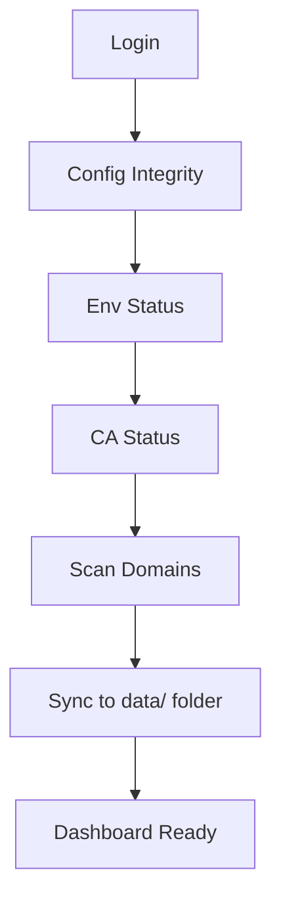
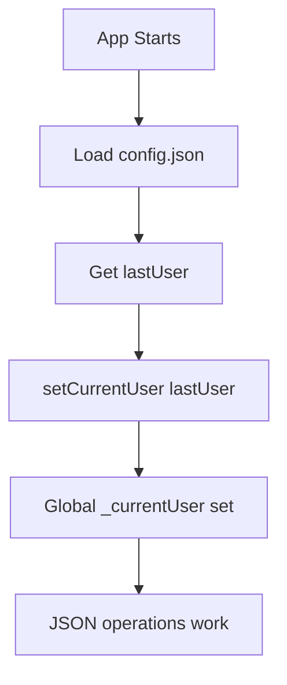
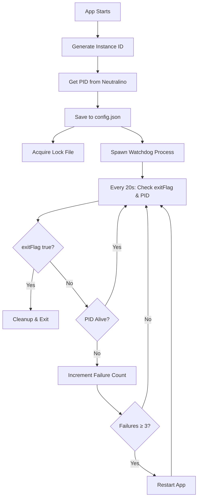

# Security & Safety Design

AMP Manager is designed with special consideration for students and junior developers.   
This document explains the reasoning behind, and why certain safety decisions were made.


## The Problem

When learning local development, students often:
- Modify config files to "see what happens"
- Accidentally delete or corrupt important files
- Break Docker settings while experimenting
- Lose hours of work trying to recover

AMP Manager implements multiple safety layers to prevent these issues.

<p align="center">
  
</p>

## Sync on Every Login

Every time a user logs in, AMP Manager runs 5 validation steps:




### Why Not Cache?

Caching would be faster, but users wouldn't notice:  

- Docker stopped running
- CA certificate expired
- Domain configs broken

**For local environments, seeing problems immediately is better than being fast.**


## Step-by-Step Safety Features

### Step 1: Config Integrity <Badge type="warning" text="Factory" />  

**What it does:**
- Copies clean versions of essential config files
- Stores in `users/` folder (encrypted)

**Why:**
- If users break `angie.conf`, they can restore from factory backup
- No need to re-download or reconfigure

**Essential files captured:**
- `docker-compose.yml`
- `docker-compose.override.yml`
- `config/angie.conf`
- `config/default.local.conf`
- `config/php.ini`
- `config/db-init/01-grant-root.sql`

**Location:** `src/services/ConfigGuardService.ts`


### Step 2: Env Status <Badge type="tip" text="Docker" /> <Badge type="info" text="Factory" />

**What it does:**
- Checks Docker is running
- Verifies all required folders exist
- Confirms mkcert is installed
- Validates CA root exists

**Why:**
- Prevents "why doesn't my site work?" when Docker isn't running
- Shows clear errors instead of confusing failures
- Catches missing tools before they cause issues

**Toast Messages:**
- Docker not running -> "Open Docker Desktop to manage your local sites"
- CA missing -> "Install CA in Settings to enable SSL"


### Step 3: CA Status

**What it does:**
- Validates mkcert certificate authority
- Checks certificate expiration

**Why:**
- Without valid CA, new domains won't have SSL
- Students need working SSL to test HTTPS features

**If missing:**
- Toast prompts user to install CA in Settings
- Prevents confusing SSL errors later


### Step 4: Scan Domains

**What it does:**
- Reads Windows hosts file for `.local` domains
- Checks AMP Manager's config folder
- Validates SSL certificates exist

**Why:**
- Syncs current system state to users/ folder
- Shows domain health on dashboard
- Catches orphaned domains (deleted files but still in hosts)


### Step 5: Sync to JSON Files

**What it does:**
- Updates all domain statuses in `users/user_{username}/domain_status.json`
- Updates sites in `users/user_{username}/sites.json`
- Stores last sync timestamp in `users/user_{username}/settings.json`
- JSON files in users/ folder are the single source of truth for the UI
- Ensures dashboard shows accurate information
- Persists across app restarts


## Defense in Depth

AMP Manager implements multiple security layers:

```mermaid
flowchart TB
    subgraph OS["Operating System"]
        UAC[UAC Elevation]
    end
    
    subgraph App["AMP Manager"]
        subgraph Frontend["Frontend"]
            AL[nativeAllowList]
            TW[AMP_TASKS Whitelist]
        end
        
        subgraph Backend["Backend"]
            BAT[amp-tasks.bat]
            OP[Protected Operations]
        end
    end
    
    UAC --> AL
    AL --> TW
    TW --> BAT
    BAT --> OP
    
    OP --> H[Hosts File]
    OP --> SSL[SSL Certs]
    OP --> D[Docker Control]
    OP --> F[File System]

    style OS fill:#0a1920,stroke:#01579b
    style App fill:#0a1920,stroke:#01579b
    style TW fill:#c62828,stroke:#e65100
    style Backend fill:#273078,stroke:#1b5e20
```



| Layer | Protection | File |
|-------|-----------|------|
| **UAC** | OS-level admin elevation | Windows |
| **nativeAllowList** | Blocks unauthorized Native API calls | `neutralino.config.json` |
| **AMP_TASKS whitelist** | Only approved commands executable | `public/js/main.js` |
| **Batch dispatcher** | Controlled command routing | `amp-tasks.bat` |


### Why This Matters

AMP runs with elevated privileges (admin rights from UAC). If JavaScript is compromised (XSS attack), the allowlists prevent the attacker from:   

- Deleting arbitrary files
- Running unauthorized commands
- Accessing sensitive data


## Data Persistence

### JSON File Storage <Badge type="info" text="User" /> <Badge type="tip" text="Folder" />

All user data is stored in the `users/user_{username}/` folder.   
The `user_` prefix avoids conflicts with MariaDB databases:

| File | Content | Encrypted? |
|------|---------|-----------|
| `users/user_{username}/user.json` | User auth (salt + validation token) | No |
| `users/user_{username}/sites.json` | Domain configurations | No |
| `users/user_{username}/tags.json` | Tags | No |
| `users/user_{username}/tunnels.json` | Active tunnels | No |
| `users/user_{username}/activity_logs.json` | Activity history | No |
| `users/user_{username}/domain_status.json` | Domain health status | No |
| `users/user_{username}/databases.json` | Database metadata | No |
| `users/user_{username}/databases_cache.json` | Database cache | No |
| `users/user_{username}/notes.json` | Notes | YES |
| `users/user_{username}/credentials.json` | Credentials | YES |
| `users/user_{username}/settings.json` | User settings | YES |
| `users/user_{username}/workflows.json` | Workflows | YES |
| `users/user_{username}/site_configs.json` | Config backups | YES |
| `config.json` | App settings (lastUser + instanceId, pid, port, launchedAt) | No |


### Why JSON Files?

- **Visible** - Students can see their data with any text editor
- **Persistent** - Survives app restarts (stored in app folder)
- **Portable** - Easy to backup (copy `users/` folder)
- **Secure** - Sensitive data encrypted with AES-256-GCM


### Security: Encryption

| Feature | Implementation |
|---------|---------------|
| Algorithm | AES-256-GCM |
| Key Derivation | PBKDF2 (310,000 iterations) |
| Salt | Random 16 bytes per user |
| IV | Random 12 bytes per encryption |


### Where Data Lives

| Component | Location |
|-----------|----------|
| App folder | `AMP-Manager/users/` (Neutralino's app data path) |
| Neutralino storage | `AMP-Manager/.storage/` (for small settings) |


## Backup & Restore

### Built-in Backup

Located in **Settings -> Backup/Restore**:   

- **Export:** Copies `user_name/` folder to json file
- **Import:** Restores from backup json

### Factory Restore

Located in **Docker -> Config Recovery**:  

- **Factory:** Original config files from Step 1
- **Snapshots:** Manual backups before destructive operations


## How User Backup Works

The backup system does exactly what is expected: it **merges multiple user JSON files into a single JSON file** for portability.

### Export Flow (Multiple → Single)

```text
users/user_name/
├── sites.json        ─┐
├── notes.json         │
├── credentials.json ──┼──►  amp-backup-2026-04-20.json
├── workflows.json     │
└── tags.json        ──┘
```

**Step-by-step:**

| Step | Action | Code |
|------|--------|------|
| 1 | Load ALL data from user JSON files | `loadSitesJSON()`, `loadNotesJSON()`, etc. (line 23-29) |
| 2 | If "includeSensitive" checked: decrypt notes & credentials | `decryptWithKey()` (lines 31-58) |
| 3 | Merge into single object with metadata | `{ version, timestamp, sites, notes, credentials, workflows, tags }` (lines 61-69) |
| 4 | Save as single JSON file | `amp-backup-2026-04-20.json` |

### Import Flow (Single → Multiple)

```text
amp-backup-2026-04-20.json  ──►  users/user_name/
                                      ├── sites.json
                                      ├── notes.json
                                      ├── credentials.json
                                      └── ...
```

**Step-by-step:**

| Step | Action | Code |
|------|--------|------|
| 1 | Load JSON file | Read from file picker |
| 2 | If overwrite: clear all user files | `saveXxxJSON(username, [])` (lines 73-80) |
| 3 | Merge with existing data | `loadXxxJSON()` + `[...existing, ...data]` (lines 83-95) |
| 4 | If notes/credentials need re-encryption: encrypt with current key | `encryptWithKey()` (lines 100-131) |
| 5 | Save to individual JSON files | `saveNotesJSON()`, `saveCredentialsJSON()`, etc. |


### Key Points

| Feature | How It Works |
|---------|--------------|
| **Decryption on export** | Gets user's current session key to decrypt notes/credentials before saving to JSON |
| **Re-encryption on import** | Gets current session key to re-encrypt before saving to user files |
| **Merge vs Overwrite** | Import has two modes: merge (add to existing) or overwrite (replace all) |
| **Portability** | Single JSON file is easy to transfer, share, or backup |
| **Security warning** | If "includeSensitive" is checked, backup contains plain-text secrets |


### Export JSON

Reads all encrypted user files → decrypts with session key → merges into one JSON → saves to file
    
### Import JSON

Reads JSON file → merges with existing user files → re-encrypts sensitive data with current key → saves to individual files
  
> This design keeps the portability of a single file while maintaining security through on-the-fly encryption/decryption.


## Complete Data Deletion

### Delete All Data Function

AMP Manager provides a complete data wipe function for testing or reset scenarios:

**Function:** `deleteUserData(username)` in `src/lib/db.ts`

**What it deletes:**  

- User-specific JSON files in `users/user_{username}/`
- Updates `config.json` to clear `lastUser`

**Location in UI:** Settings -> Account -> "Delete All Data"

**Use cases:**  

- Complete app reset for fresh start
- Testing clean installation scenarios
- User wants to remove all data before giving away device

<Badge type="danger" text="Danger" />

> **Warning:** This action cannot be undone. All user data, domains, credentials, and settings will be permanently deleted.


## Summary

| Safety Feature | Purpose |
|---------------|---------|
| Sequential sync | Prevents race conditions |
| Factory backup | One-click restore |
| Always validates | Catches problems early |
| Defense-in-depth | Limits damage from attacks |
| Per-user JSON | Data isolation |


> This design prioritizes **reliability and stability**, making it safe for users to learn through experimentation without breaking the app.

## User State Restoration

On app startup, AMP Manager restores user state to enable JSON operations without re-login:



**Flow:**
1. `main.tsx` loads `config.json` → gets `lastUser`
2. Calls `setCurrentUser(lastUser)` in `db.ts`
3. Global `_currentUser` enables `ensureUser()` for JSON operations

**Why this matters:**
- Users need to re-login after app restart
- JSON storage functions work immediately without auth errors
- Dashboard loads correct user data on startup

**Key files:**
- `src/lib/db.ts:12-14` - `setCurrentUser()` function
- `src/lib/db.ts:28-31` - `ensureUser()` throws if not set
- `src/main.tsx:16-18` - Restores user on startup

> **Security note:** The encryption key is NOT stored - users must re-login to decrypt encrypted files. Only the username is persisted in `config.json`.


## Instance Monitoring

### Watchdog

AMP Manager includes a built-in watchdog that monitors the app for Neutralino.js zombie states and auto-recovers.

### How It Works



### Instance Info Flow

| Step | File | Action |
|------|------|--------|
| 1 | `main.tsx` | Generate `instanceId`, get `NL_PID` |
| 2 | `db.ts:updateInstanceInfo()` | Save to config.json (merges with existing) |
| 3 | `AMPBridge.ts:killStaleWatchdogs()` | Cleanup stale watchdogs on startup |
| 4 | `AMPBridge.ts:spawnWatchdog()` | Spawn background process |
| 5 | `amp-tasks.bat :WATCH` | Read config.json, monitor PID, check exitFlag |

### config.json Contents

```json
{
  "lastUser": "nuno",
  "instanceId": "amp-1234567890-abc123",
  "processName": "amp-manager-win_x64.exe",
  "pid": "12345",
  "exitFlag": false,
  "launchedAt": 1234567890123
}
```

### Lock File Mechanism

Prevents duplicate watchdogs from running simultaneously:

```
%TEMP%\amp_watchdog.lock
```

| Step | Action |
|------|--------|
| 1 | Check if lock file exists → if yes, another watchdog running, exit |
| 2 | Create empty lock file to claim "ownership" |
| 3 | Run monitoring loop |
| 4 | On exit: delete lock file |

### exitFlag Pattern

Distinguishes clean user exit from app crash:

| Scenario | exitFlag | Result |
|----------|----------|--------|
| User clicks X | `true` (set by frontend) | Watchdog cleans up lock, exits |
| App crash | `false` | Watchdog counts failures, restarts app |

**Why this matters:**
- User clicks X → app sets exitFlag → watchdog exits cleanly
- App crashes → exitFlag never set → watchdog detects PID gone → restarts app

### Clean Close Flow

When user clicks the X button:

```typescript
// src/components/layout/Layout.tsx:245-277
const handleClose = async () => {
  // STEP 1: Set exitFlag = true
  const config = await loadConfigJSON() ?? {};
  config.exitFlag = true;
  config.exitTime = Date.now();
  await saveConfigJSON(config);

  // STEP 2: Delete lock file
  await window.Neutralino.os.execCommand({
    command: 'del "%TEMP%\amp_watchdog.lock" 2>nul'
  });

  // STEP 3: Exit app
  await window.Neutralino.app.exit();
};
```

### Important: Merge Pattern

When updating `config.json`, **always merge with existing data** to preserve instance info.

<Badge type="danger" text="WRONG" /> **DON'T do this:**

```typescript
// WRONG - overwrites entire config
await dataStorage.save('config.json', { lastUser: username });
```

<Badge type="info" text="CORRECT" /> **Use merge:**

```typescript
// CORRECT - merges with existing
const existing = await dataStorage.load('config.json') || {};
await dataStorage.save('config.json', { ...existing, lastUser: username });
```

**Files that update config.json:**
- `main.tsx` - Saves instance info on startup
- `AuthContext.tsx` - Saves lastUser on login/register/logout
- `db.ts:deleteUserData()` - Clears lastUser on data deletion

All use the merge pattern to preserve instance info.

### Why Watchdog Exists

| Problem | Solution |
|---------|----------|
| NeutralinoJS single-threaded event loop | Watchdog monitors from outside |
| Backend becomes unresponsive (zombie) | PID check detects failure |
| `serverOffline` event unreliable | Independent 20s check cycle |
| App appears frozen but process runs | Force restart after 3 failures |
| No way to distinguish exit vs crash | exitFlag pattern enables clean detection |


## See Also

- [Architecture Overview](./architecture)
- [AMP Tasks Reference](./amp-tasks-reference)
- [State Management](./state-management)
- [Troubleshooting](./troubleshooting)