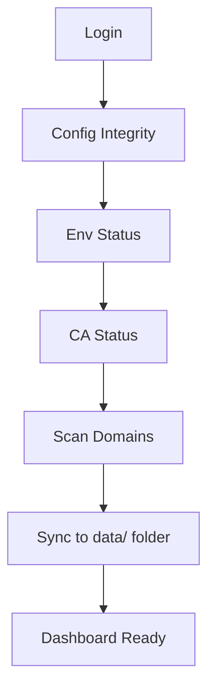
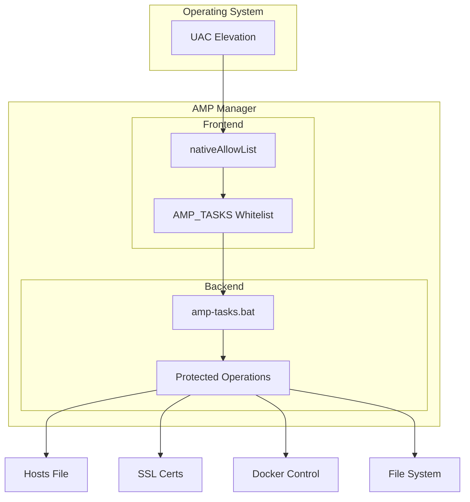

# Security & Safety Design

AMP Manager is designed for students and junior developers. This document explains why certain safety decisions were made.

---

## The Problem

When learning local development, students often:
- Modify config files to "see what happens"
- Accidentally delete or corrupt important files
- Break Docker settings while experimenting
- Lose hours of work trying to recover

AMP Manager implements multiple safety layers to prevent these issues.

---

## Sync on Every Login

Every time a user logs in, AMP Manager runs 5 validation steps:

### Why Not Cache?

caching would be faster, but students wouldn't notice:
- Docker stopped running
- CA certificate expired
- Domain configs broken

**For learning environments, seeing problems immediately is better than being fast.**

---

## Step-by-Step Safety Features

### Step 1: Config Integrity (Capture Factory)

**What it does:**
- Copies clean versions of essential config files
- Stores in `users/` folder (encrypted)

**Why:**
- If student breaks `angie.conf`, they can restore from factory backup
- No need to re-download or reconfigure

**Essential files captured:**
- `docker-compose.yml`
- `docker-compose.override.yml`
- `config/angie.conf`
- `config/default.local.conf`
- `config/php.ini`
- `config/db-init/01-grant-root.sql`

**Location:** `src/services/ConfigGuardService.ts`

---

### Step 2: Env Status (Docker, Folders)

**What it does:**
- Checks Docker is running
- Verifies all required folders exist
- Confirms mkcert is installed
- Validates CA root exists

**Why:**
- Prevents "why doesn't my site work?" when Docker isn't running
- Shows clear errors instead of confusing failures
- Catches missing tools before they cause issues

**Toast Messages:**
- Docker not running -> "Open Docker Desktop to manage your local sites"
- CA missing -> "Install CA in Settings to enable SSL"

---

### Step 3: CA Status

**What it does:**
- Validates mkcert certificate authority
- Checks certificate expiration

**Why:**
- Without valid CA, new domains won't have SSL
- Students need working SSL to test HTTPS features

**If missing:**
- Toast prompts user to install CA in Settings
- Prevents confusing SSL errors later

---

### Step 4: Scan Domains

**What it does:**
- Reads Windows hosts file for `.local` domains
- Checks AMP Manager's config folder
- Validates SSL certificates exist

**Why:**
- Syncs current system state to users/ folder
- Shows domain health on dashboard
- Catches orphaned domains (deleted files but still in hosts)

---

### Step 5: Sync to JSON Files

**What it does:**
- Updates all domain statuses in `users/user_{username}/domain_status.json`
- Updates sites in `users/user_{username}/sites.json`
- Stores last sync timestamp in `users/user_{username}/settings.json`
- JSON files in users/ folder are the single source of truth for the UI
- Ensures dashboard shows accurate information
- Persists across app restarts

---

## Defense in Depth

AMP Manager implements multiple security layers:

| Layer | Protection | File |
|-------|-----------|------|
| **UAC** | OS-level admin elevation | Windows |
| **nativeAllowList** | Blocks unauthorized Native API calls | `neutralino.config.json` |
| **AMP_TASKS whitelist** | Only approved commands executable | `public/js/main.js` |
| **Batch dispatcher** | Controlled command routing | `amp-tasks.bat` |

### Why This Matters

AMP runs with elevated privileges (admin rights from UAC). If JavaScript is compromised (XSS attack), the allowlists prevent the attacker from:
- Deleting arbitrary files
- Running unauthorized commands
- Accessing sensitive data

---

## Data Persistence

### JSON File Storage (users/ folder)

All user data is stored in the `users/user_{username}/` folder. The `user_` prefix avoids conflicts with MariaDB databases:

| File | Content | Encrypted? |
|------|---------|-----------|
| `users/user_{username}/user.json` | User auth (salt + validation token) | No |
| `users/user_{username}/sites.json` | Domain configurations | No |
| `users/user_{username}/tags.json` | Tags | No |
| `users/user_{username}/tunnels.json` | Active tunnels | No |
| `users/user_{username}/activity_logs.json` | Activity history | No |
| `users/user_{username}/domain_status.json` | Domain health status | No |
| `users/user_{username}/databases.json` | Database metadata | No |
| `users/user_{username}/databases_cache.json` | Database cache | No |
| `users/user_{username}/notes.json` | Notes | YES |
| `users/user_{username}/credentials.json` | Credentials | YES |
| `users/user_{username}/settings.json` | User settings | YES |
| `users/user_{username}/workflows.json` | Workflows | YES |
| `users/user_{username}/site_configs.json` | Config backups | YES |
| `config.json` | App settings (lastUser only) | No |

### Why JSON Files?

- **Visible** - Students can see their data with any text editor
- **Persistent** - Survives app restarts (stored in app folder)
- **Portable** - Easy to backup (copy `users/` folder)
- **Secure** - Sensitive data encrypted with AES-256-GCM

### Security: Encryption

| Feature | Implementation |
|---------|---------------|
| Algorithm | AES-256-GCM |
| Key Derivation | PBKDF2 (310,000 iterations) |
| Salt | Random 16 bytes per user |
| IV | Random 12 bytes per encryption |

### Where Data Lives

| Component | Location |
|-----------|----------|
| App folder | `AMP-Manager/users/` (Neutralino's app data path) |
| Neutralino storage | `AMP-Manager/.storage/` (for small settings) |

---

## Backup & Restore

### Built-in Backup

Located in **Settings -> Backup/Restore**:
- **Export:** Copies `users/` folder to ZIP file
- **Import:** Restores from backup ZIP

### Factory Restore

Located in **Docker -> Config Recovery**:
- **Factory:** Original config files from Step 1
- **Snapshots:** Manual backups before destructive operations

---

## Complete Data Deletion

### Delete All Data Function

AMP Manager provides a complete data wipe function for testing or reset scenarios:

**Function:** `deleteUserData(username)` in `src/lib/db.ts`

**What it deletes:**
- User-specific JSON files in `users/user_{username}/`
- Updates `config.json` to clear `lastUser`

**Location in UI:** Settings -> Account -> "Delete All Data"

**Use cases:**
- Complete app reset for fresh start
- Testing clean installation scenarios
- User wants to remove all data before giving away device

**Warning:** This action cannot be undone. All user data, domains, credentials, and settings will be permanently deleted.

---

## Summary

| Safety Feature | Purpose |
|---------------|---------|
| Sequential sync | Prevents race conditions |
| Factory backup | One-click restore |
| Always validates | Catches problems early |
| Defense-in-depth | Limits damage from attacks |
| Per-user JSON | Data isolation |

This design prioritizes **learning safety** over **performance**, making it ideal for students and junior developers.

---

## See Also

- [Architecture Overview](./03-Architecture.md)
- [AMP Tasks Reference](./04-Amp-Tasks-Reference.md)
- [State Management](./03-State-Management.md)
- [Troubleshooting](./12-Troubleshooting.md)