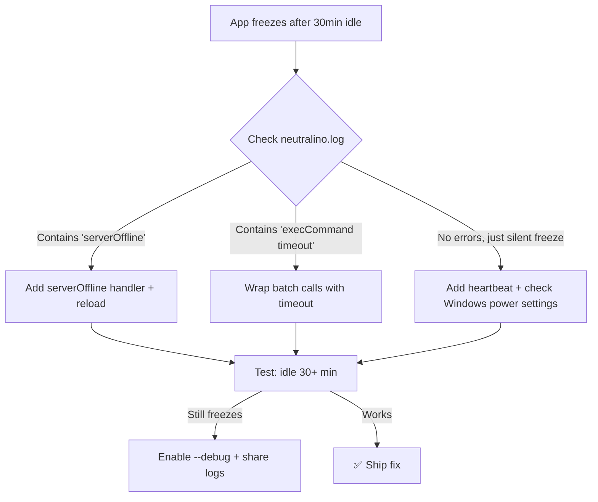
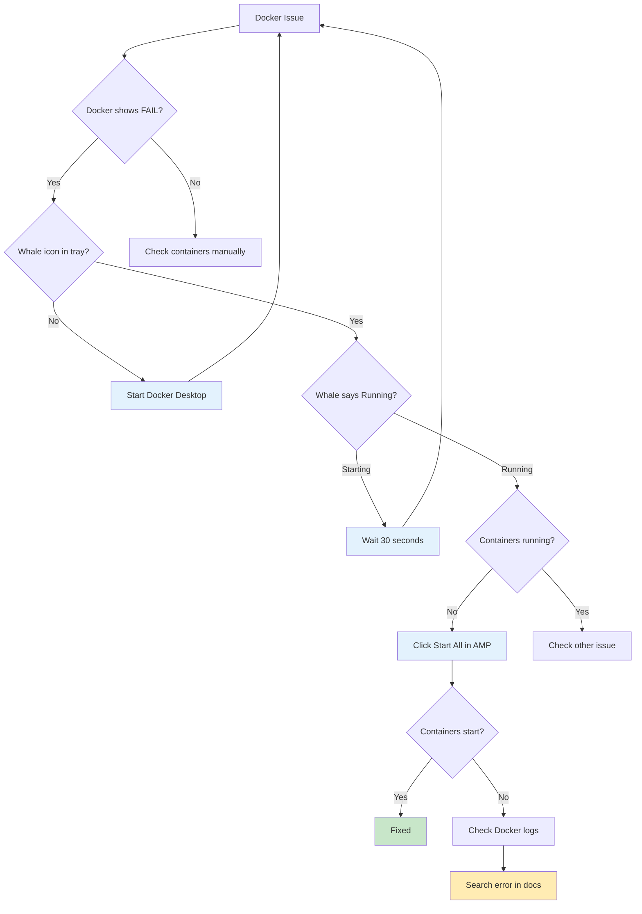
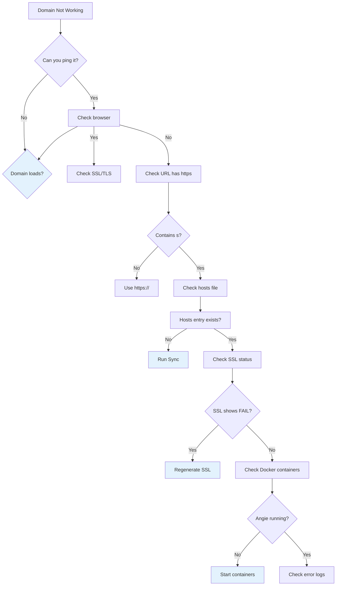
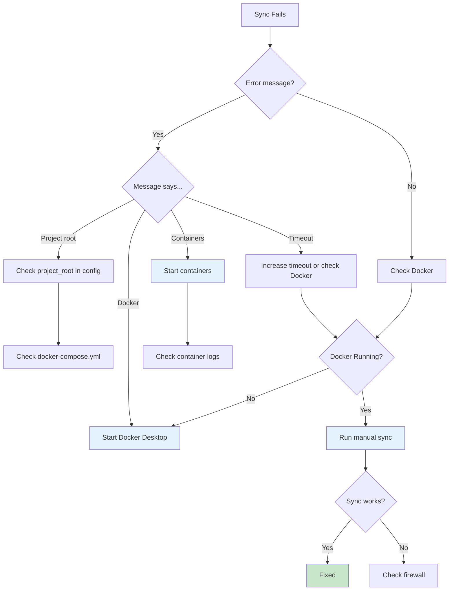
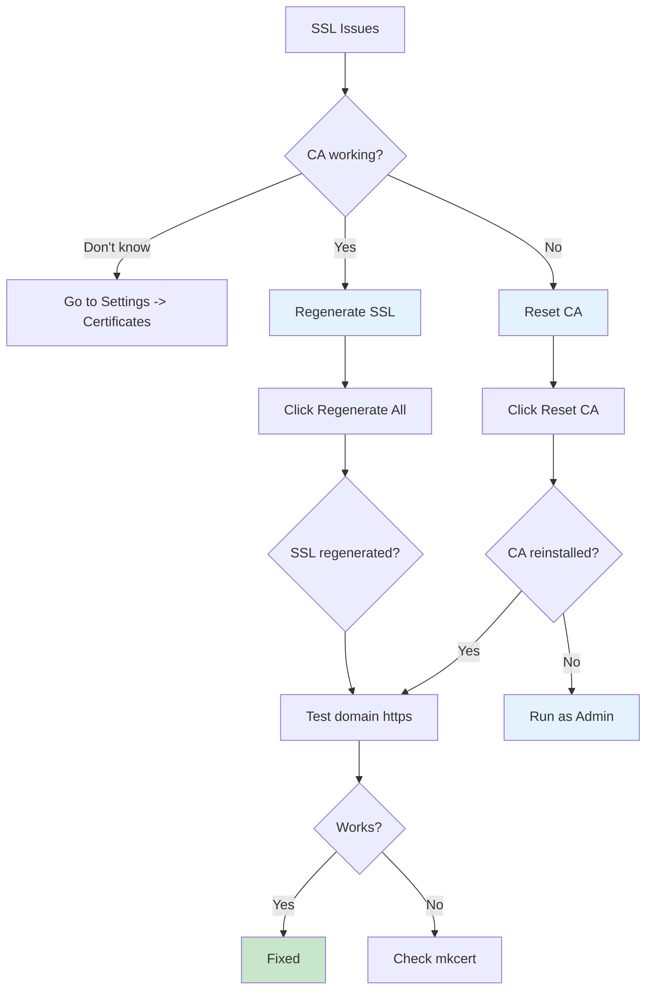
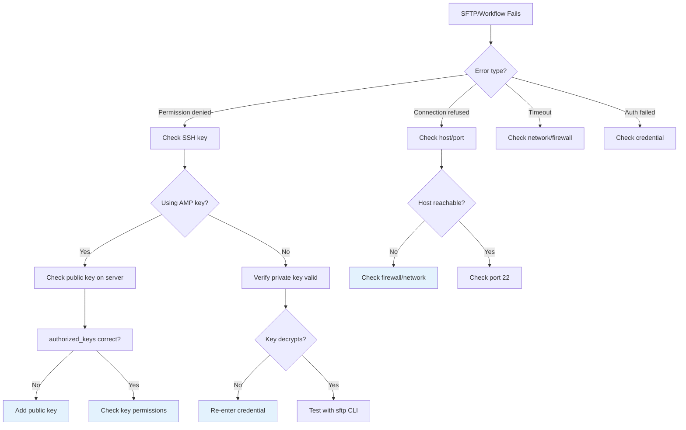

# Troubleshooting Guide

Visual decision trees to help diagnose and fix common issues.


## Quick Decision Trees


### Neutralinojs Idle Freeze




### Docker Issues




### Domain Not Working




### Sync Fails




### SSL/Certificate Issues




### Workflow/SFTP Issues




## Common Error Messages

### "Backend not connected"

| Cause | Solution |
|-------|----------|
| Not running desktop app | Run `amp-manager.exe` |
| Neutralino not started | Check app logs |
| Browser mode | Normal in dev (`npm run dev`) |

### "Docker not responding"

| Cause | Solution |
|-------|----------|
| Docker not running | Start Docker Desktop |
| WSL2 not installed | Install WSL2 update |
| Containers stopped | Click "Start All" in Docker page |

### "Permission denied" (hosts file)

| Cause | Solution |
|-------|----------|
| Not running as admin | Right-click amp-manager.exe -> Run as administrator |

### "SSL certificate invalid"

| Cause | Solution |
|-------|----------|
| CA not trusted | Run as admin once to install CA |
| Expired certificate | Regenerate SSL in Settings |

### "Certificate Authority not installed" Error

When creating a new domain, you get:

```
"Error: Certificate Authority not installed. Please install CA from the Certificates page before creating sites."
```

| Cause | Solution |
|-------|----------|
| App built without UAC manifest | If you built manually, run `post-build.bat` after `npm run build:app` |
| App not running as admin | Right-click amp-manager.exe -> "Run as administrator" |
| Using release from GitHub | Releases already have UAC - run as admin |

**Why this happens**: Installing SSL certificates (via mkcert) requires admin privileges. The post-build script applies a UAC manifest that enables this.


## Diagnostic Commands

### Check System Status

```bash
# In AMP Terminal
status
```

### Check Docker Containers

```bash
# In AMP Terminal
docker ps -a
```

### Check Hosts File

```bash
# In AMP Terminal
type C:\Windows\System32\drivers\etc\hosts
```

### Check SSL Certificates

```bash
# In AMP Terminal
caStatus
```


## Getting Help

If the decision trees don't help:

1. **Check logs**: Open DevTools (F12) -> Console
2. **Check Docker logs**: `docker logs container_name`
3. **Search existing issues**: [GitHub Issues](https://github.com/Amp-Manager/amp-manager/issues)


## Prevention Tips

| Issue | Prevention |
|-------|-------------|
| Docker FAIL | Keep Docker Desktop running |
| SSL issues | Don't modify `C:\amp` manually |
| Sync fails | Always run as admin first time |
| SFTP fails | Test with CLI first |


## Docker Issues

### Docker Shows "FAIL" in Dashboard

**Symptom**: Dashboard displays "Docker Running: FAIL" under System Checks.

**Cause**: Docker daemon is stopped, starting, or not responding.

**Solution**:
1. Open Docker Desktop and verify it's running (green icon in system tray)
2. If Docker is starting, wait 30 seconds for full initialization
3. If Docker appears stuck, right-click tray icon -> Restart Docker
4. Click the refresh button on the AMP dashboard

**Why AMP shows this**: AMP checks Docker status with a 5-second timeout. If Docker doesn't respond in time, AMP reports FAIL to indicate Docker needs attention.

**Note**: This is a Docker issue, not an AMP issue. AMP correctly reports the problem.


### Containers Not Starting

**Symptom**: Docker containers (angie, php, db) show as stopped.

**Solution**:
1. Ensure Docker Desktop is running
2. In AMP, go to Docker page and click "Start All"
3. Check Docker Desktop logs if containers fail to start
4. Try restarting Docker Desktop


### First-Time Container Setup

**Symptom**: Containers fail to start or show "no container found".

**Understanding Docker Compose Commands**:

| Command | When to Use |
|---------|-------------|
| `docker compose up -d` | **First time only** - Pulls images, creates, and starts containers |
| `docker compose start -d` | **Subsequent runs** - Starts existing containers (faster) |
| `docker compose stop -t 0` | Stop containers quickly |
| `docker compose restart --no-health` | Restart without waiting for health checks |

**How AMP Handles This**:
- AMP uses `docker compose start` for existing containers (faster, no re-pull)
- If you need to rebuild containers from scratch, run manually:
  ```cmd
  docker compose down
  docker compose up -d
  ```
- Then use AMP's "Start All" button for normal operations


## Sync Issues

### Sync Stuck on "Resolving Environment"

**Symptom**: System preloader shows "Resolving environment" indefinitely.

**Cause**: Usually caused by Docker not responding (see Docker Issues above).

**Solution**:
1. Check if Docker is running
2. Restart Docker if needed
3. AMP will either complete sync or show error after timeout


## SSL/Certificate Issues

### Domains Show "SSL: FAIL"

**Symptom**: Dashboard shows SSL certificate validation failed for domains.

**Solution**:
1. Go to Settings -> Certificates
2. Click "Regenerate All SSL"
3. Wait for regeneration to complete
4. Refresh dashboard


### Certificate Authority Not Working

**Symptom**: mkcert errors or certificate generation fails.

**Solution**:
1. Go to Settings -> Certificates
2. Check CA status
3. If needed, click "Reset CA" to reinstall the certificate authority
4. Regenerate SSL certificates


## General Tips

- **Restart Docker** - Solves most issues (Docker stuck, containers not responding)
- **Refresh Dashboard** - Click the refresh button to re-run system checks
- **Check Logs** - AMP logs errors to browser console (F12 -> Console)
- **AMP is resilient** - Even if sync fails, you can continue using the app


## Workflow / SFTP Issues

### SFTP Password Authentication Not Supported

**Symptom**: SFTP workflow fails with credential errors.

**Cause**: AMP only supports SSH key authentication for SFTP. Password-based SFTP is not supported.

**Solution**:
1. Generate an SSH key (auto-generated on first login, or manually in Settings)
2. Add your public key to the remote server: `~/.ssh/authorized_keys`
3. Create a credential in Credentials Vault:
   - Type: `SSH Private Key`
   - Paste your private key
4. In Workflow editor, select the SSH credential for your SFTP node

**Why**: Windows does not have built-in tools for interactive SFTP password authentication. SSH key auth is more secure and works natively.

**Alternative**: Use external tools like WinSCP or FileZilla for password-based SFTP transfers.


### SFTP Transfer Fails

**Symptom**: SFTP workflow shows error during file transfer.

**Solutions**:
1. **Check SSH key**: Ensure the private key in your credential matches the public key on the server
2. **Verify host**: Ensure the SFTP host is correct and accessible
3. **Check permissions**: Remote directory must be writable by the SSH user
4. **Test manually**: Run `sftp -i "C:\Users\you\.ssh\id_ed25519" user@host` in terminal to verify

## NeutralinoJS Zombie State (App Freezes After Sleep)

### Symptom

- App window becomes unresponsive after PC wakes from sleep
- Cannot drag, minimize, or close the window
- Task Manager shows "A neutralino.js application" (not our app name)
- Backend connection is lost - NL_PATH/NL_TOKEN becomes undefined

### Root Cause

This is a known limitation of NeutralinoJS on Windows. When the PC enters sleep and wakes:
1. The WebSocket connection between frontend and backend breaks
2. The backend becomes unresponsive (zombie state)
3. The `serverOffline` event often doesn't fire reliably
4. Internal recovery mechanisms cannot fix this state

### Solution: Automatic Watchdog

AMP Manager includes a built-in watchdog that monitors and auto-restarts the app:

#### How It Works

| Step | Action |
|------|--------|
| 1 | App launches → saves PID, port, processName to config.json |
| 2 | Watchdog spawns as background process |
| 3 | Every 30 seconds, watchdog checks: |
|   | - Is stored PID still running? |
|   | - Is port responding? |
| 4 | If checks fail 2 times in a row → kill and restart app |
| 5 | User sees login screen again - seamless recovery |

#### Config.json Watchdog Data

```json
{
  "lastUser": "domain",
  "processName": "amp-manager-win_x64.exe",
  "pid": "12345",
  "port": 15125,
  "instanceId": "amp-1234567890-abc123",
  "launchedAt": 1234567890
}
```

#### Manual Recovery (If Watchdog Fails)

If the watchdog cannot recover the app:

1. Press `Ctrl+Shift+Esc` to open Task Manager
2. Find "AMP Manager" or "A neutralino.js application"
3. End the task
4. Restart the app manually


## See Also

- [Home](./index) - Overview
- [For Users](./for-users) - Beginner setup
- [Security Design](./security) - Why sync runs every login