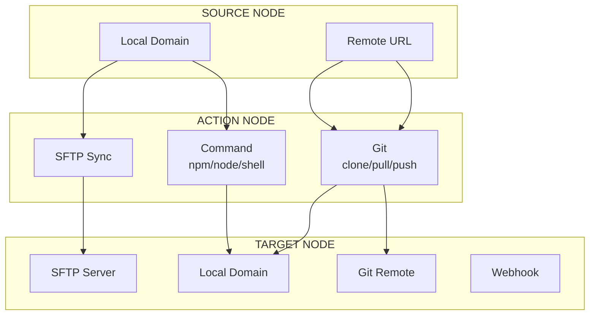
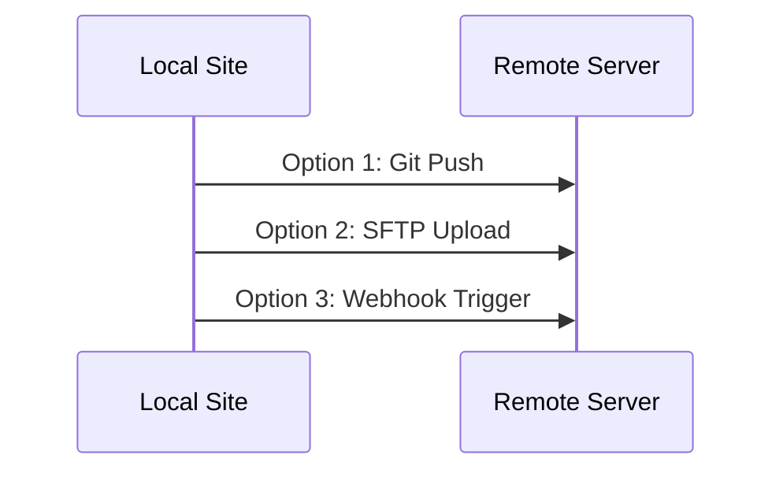
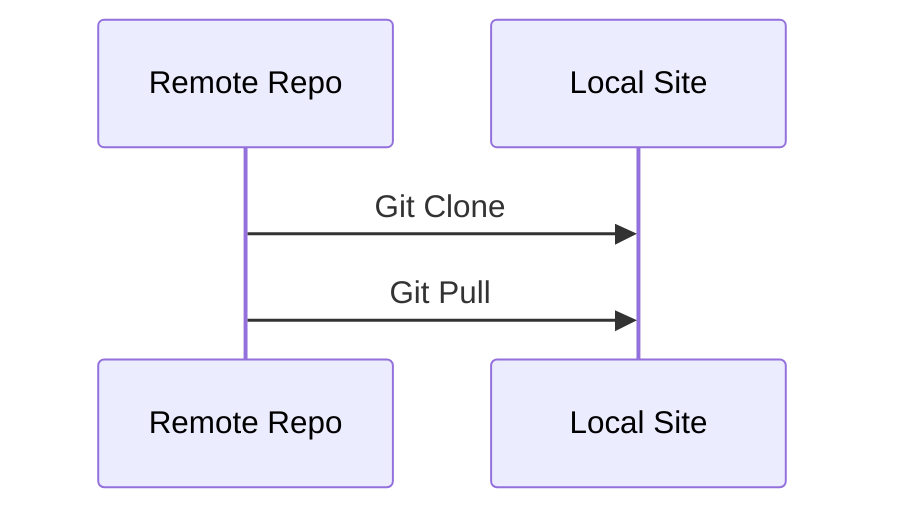
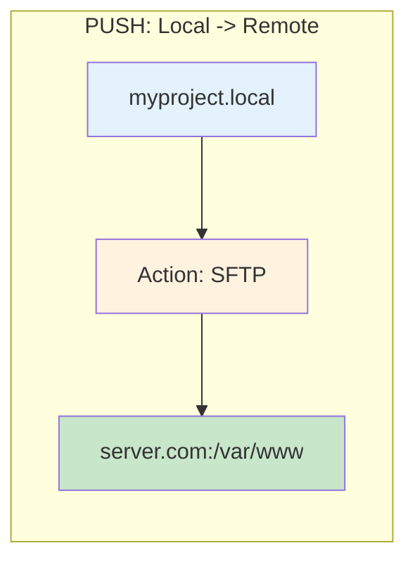
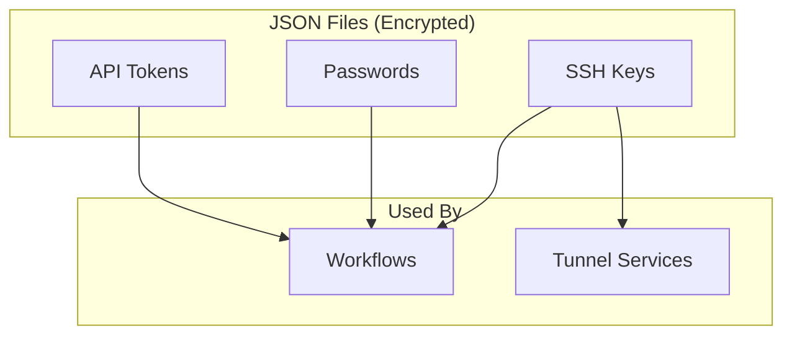
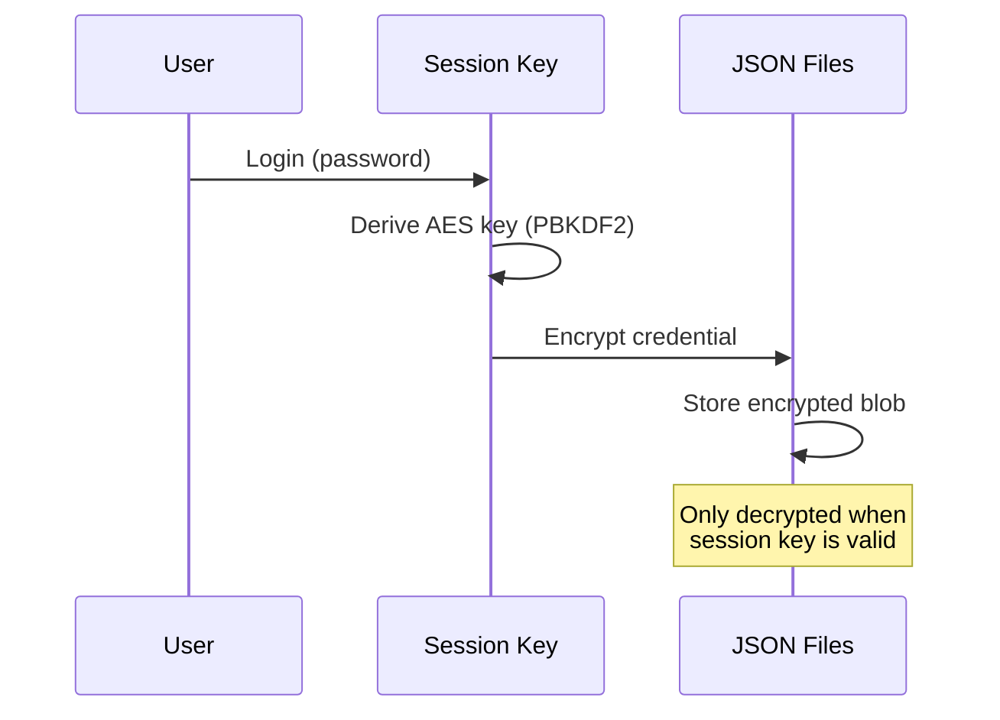

# Workflows & Deployment

AMP Manager's Workflow feature enables bi-directional automation:
- **Push**: Local site -> Remote server (git/SFTP)
- **Pull**: Remote repo -> Local site (git clone)


## How Workflows Work



### Node Types

| Node | Purpose | Options |
|------|---------|---------|
| **Source** | Where to start | Local domain, Remote URL |
| **Action** | What to do | Command, Git, SFTP |
| **Target** | Where to go | Local domain, Git, SFTP, Webhook |


## Bi-Directional Workflows

### Push: Local -> Remote



**Use cases:**
- Deploy code to production server
- Upload files via SFTP
- Trigger CI/CD pipelines

### Pull: Remote -> Local



**Use cases:**
- Clone a repository to local development
- Pull latest changes from main branch


## SSH Key Authentication

AMP Manager automatically generates an SSH key pair when you first log in. This key identifies your machine for secure connections.

### How It Works

| Step | What Happens | Who Handles It |
|------|--------------|----------------|
| **1. Generate** | AMP creates key pair at `~/.ssh/id_ed25519` | AMP Manager |
| **2. Copy** | You copy the **public key** to remote servers | You |
| **3. Connect** | AMP uses the **private key** to authenticate | AMP Manager |

**Golden Rule:** The private key never leaves your machine. Only the public key is shared.


## Which Key Do I Share?

Always the **public key** (ends in `.pub`).  
Never share the **private key** - it stays on your machine.

### Why Does This Work?

SSH uses "asymmetric cryptography": what the public key encrypts, only the private key can decrypt. The server sends a challenge encrypted with your public key; your private key solves it. The server never sees your private key - it just verifies the answer.

### Simple Explanation

> "Imagine you have a secret handshake. The public key is like a video of someone else doing their half of the handshake. The private key is your half. When you connect, the server shows you the video (public key), and you complete the handshake with your secret move (private key). The server sees the full handshake works - but never learns your secret move."


## Getting Your Public Key

1. Go to **Credentials Vault** in AMP Manager
2. Find the **AMP Manager SSH Key** card at the top
3. Click **[Copy Public Key]**
4. Paste it where needed (server, GitHub, etc.)


## Creating Your First Workflow

### Push: Local to Remote (SFTP Deploy)

1. Go to **Workflows**
2. Click **+ New Workflow**
3. Add **Source Node**: Select your local domain
4. Add **Action Node** -> Type: `sftp_sync`
   - Host: `your-server.com`
   - Credential: Select your SSH key
   - Remote Path: `/var/www/html`
5. Click **Run**



### Pull: Remote to Local (Git Clone)

1. Go to **Workflows**
2. Click **+ New Workflow**
3. Add **Source Node**: Type: `remote`, URL: `git@github.com:user/repo.git`
4. Add **Action Node** -> Type: `git_clone`
   - Branch: `main` (or leave blank)
5. Add **Target Node** -> Type: `local`, Domain: Select local domain
6. Click **Run**

```mermaid
flowchart LR
    subgraph Pull["PULL: Remote -> Local"]
        S[git@github.com:user/repo.git] --> A[Action: Git Clone]
        A --> T[myproject.local]
    end
    style S fill:#e3f2fd
    style A fill:#fff3e0
    style T fill:#c8e6c9
```

### Git Push to Remote

1. Add **Source Node**: Select local domain
2. Add **Action Node** -> Type: `git_push`
   - Branch: `main`
3. Add **Target Node** -> Type: `git`, Remote: `origin`

### Git Pull from Remote

1. Add **Source Node**: Select local domain
2. Add **Action Node** -> Type: `git_pull`
   - Branch: `main`
3. Domain context is used automatically


## Quick Reference: Workflow Combinations

| Source | Action | Target | Result |
|--------|--------|--------|--------|
| Local Domain | SFTP Sync | Remote Server | Deploy to server |
| Remote URL | Git Clone | Local Domain | Clone repo locally |
| Local Domain | Git Push | Git Remote | Push to repo |
| Local Domain | Git Pull | Local Domain | Pull from remote |
| Local Domain | Webhook | External URL | Trigger webhook |
| Local Domain | Shell Command | Local | Run npm/build |


## Credentials Vault

AMP Manager's Credentials Vault securely stores SSH keys, passwords, and API tokens. All credentials are encrypted with AES-GCM using your session key.



### Credential Types

| Type | Use Case | Fields |
|------|----------|--------|
| **SSH Key** | SFTP, Git authentication | Username, Public Key, Private Key |
| **Password** | Database, FTP | Username, Password |
| **API Key** | External APIs, tokens | Token |

### How Encryption Works



### Adding a Credential

1. Go to **Credentials Vault**
2. Click **+ Add Credential**
3. Choose type (SSH Key, Password, or API Key)
4. Fill in required fields
5. Add tags for organization
6. Click **Save**

### AMP Manager SSH Key

AMP automatically generates an SSH key on first login:

- **Purpose**: SFTP workflows, tunnel services
- **Location**: `~/.ssh/id_ed25519`
- **Management**: Found at the top of Credentials Vault

**Adding to a server:**
1. Copy the public key from Credentials Vault
2. Add to server's `~/.ssh/authorized_keys`

### Using Credentials in Workflows

When creating SFTP actions in workflows:

1. Select the credential you want to use
2. The username is auto-filled from the credential
3. AMP handles key decryption automatically


## Deployment Platforms

### GitHub / GitLab

1. Go to your repository **Settings** -> **Deploy keys**
2. Click **Add deploy key**
3. Paste your public key
4. Check **Allow write access** if you need push access

### Vercel / Netlify / Railway / Render

1. Go to **Account Settings** -> **SSH Keys**
2. Add your public key
3. Or use **Git Integration** with deploy keys

### VPS / Custom Server

```bash
# On your server, add the public key:
echo "PASTE_PUBLIC_KEY_HERE" >> ~/.ssh/authorized_keys
chmod 600 ~/.ssh/authorized_keys
```

### Shared Hosting (cPanel)

1. Log into cPanel
2. Go to **SSH Access** -> **Manage SSH Keys**
3. Click **Import Key** or **Paste** your public key
4. Click **Authorize**


## SFTP Deployment with Workflows

AMP Manager supports SFTP workflows for uploading files to servers.

### Setting Up SFTP

1. **Add SSH credential** in Credentials Vault
2. **Create workflow** in Workflow editor
3. **Add SFTP node** with:
   - **Host**: Your server address
   - **Remote Path**: Destination folder (e.g., `/public_html`)
   - **Credential**: Select your SSH credential

### Default vs Custom Keys

| Type | When to Use | Security |
|------|-------------|----------|
| **AMP Manager SSH Key** | Personal servers, VPS | Key stays on your machine |
| **Custom SSH Key** | Shared projects, team credentials | Encrypted in Credentials Vault |


## Supported Platforms for SFTP

| Platform | SFTP Support | Notes |
|----------|--------------|-------|
| Any VPS | Yes | DigitalOcean, Linode, AWS EC2 |
| Shared Hosting | Yes | Most cPanel hosts |
| Managed WordPress | Varies | Check with provider |
| PaaS (Vercel, Heroku) | No | Use Git deploy instead |


## Troubleshooting

### "Permission Denied" on Connection

1. Verify public key is in `~/.ssh/authorized_keys` on server
2. Check file permissions: `chmod 600 ~/.ssh/authorized_keys`
3. Ensure SSH service is running on server

### SFTP Workflow Fails

1. Test connection manually: `sftp -i ~/.ssh/id_ed25519 user@host`
2. Verify host and username are correct
3. Check server allows SFTP (not just SSH shell)

### AMP SSH Key Missing

If key was deleted, regenerate it:
1. Go to **Settings** -> **SSH Key**
2. Click **Regenerate Key**
3. Update public key on all servers


## See Also

- [Troubleshooting](./troubleshooting) - Common issues
- [Architecture Overview](./architecture) - How AMP works
- [State Management](./state-management) - Data storage